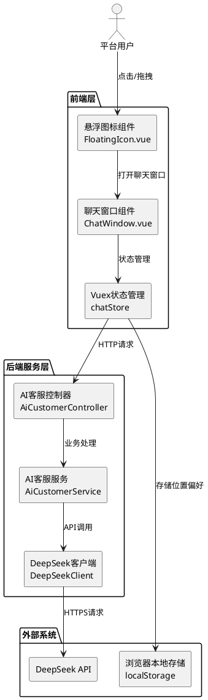

# **AI智能客服功能技术设计文档**

## **1. 实现模型**

### **1.1 上下文视图**

AI智能客服功能作为Paw福宠物服务平台的核心交互组件，与以下系统元素产生交互：

**上游依赖：**
- 用户认证系统（可选）：获取用户身份信息用于日志记录
- 配置中心：读取DeepSeek API配置、上下文提示词配置

**下游依赖：**
- DeepSeek API：第三方AI服务，提供智能问答能力
- 浏览器本地存储：保存用户位置偏好和会话历史

**横向协作：**
- 监控系统：上报API调用指标和错误日志
- 安全组件：输入内容过滤和频率限制



### **1.2 服务/组件总体架构**

#### **1.2.1 后端架构设计**

采用经典的三层架构，结合Spring Boot框架特性：

```
Controller层（接口层）
    ↓ 负责请求验证、参数转换、响应封装
Service层（业务层）
    ↓ 负责业务逻辑、上下文构建、异常处理
Client层（集成层）
    ↓ 负责与DeepSeek API交互、重试机制
```

**核心组件职责：**

| 组件 | 职责 | 技术要点 |
|------|------|----------|
| AiCustomerController | 接收前端聊天请求，返回AI回答 | REST API设计、参数验证、统一响应封装 |
| AiCustomerService | 构建上下文提示词，处理业务逻辑 | 领域知识注入、输入过滤、频率限制 |
| DeepSeekClient | 封装DeepSeek API调用 | HTTP客户端配置、超时控制、重试机制 |
| AiChatRequest | 请求参数模型 | 参数校验、XSS过滤 |
| AiChatResponse | 响应数据模型 | 统一响应格式、错误码定义 |
| DeepSeekConfig | API配置类 | 密钥管理、超时配置、端点配置 |
| RateLimiter | 频率限制组件 | 基于Redis的滑动窗口算法 |

#### **1.2.2 前端架构设计**

采用Vue 2组件化设计，结合Vuex状态管理：

```
组件层
├── FloatingIcon.vue（悬浮图标组件）
│   ├── 拖拽功能（drag事件监听）
│   ├── 点击打开聊天窗口
│   └── 位置记忆（localStorage）
└── ChatWindow.vue（聊天窗口组件）
    ├── 消息列表渲染
    ├── 输入框交互
    ├── 快捷问题按钮
    └── 打字动画效果

状态管理层（Vuex）
└── modules/chat.js
    ├── messages（消息列表）
    ├── loading（加载状态）
    ├── isOpen（窗口状态）
    └── iconPosition（图标位置）
```

**核心组件职责：**

| 组件 | 职责 | 技术要点 |
|------|------|----------|
| FloatingIcon.vue | 悬浮图标展示与交互 | CSS固定定位、拖拽事件、位置持久化 |
| ChatWindow.vue | 聊天窗口界面与交互 | Element UI组件、消息渲染、打字动画 |
| chat.js（Vuex） | 聊天状态管理 | 消息列表管理、异步请求、状态同步 |
| chatApi.js | 后端API封装 | Axios实例、请求拦截、错误处理 |

### **1.3 实现设计文档**

#### **1.3.1 后端实现方案**

##### **1.3.1.1 DeepSeek API对接设计**

**API配置：**

```java
// DeepSeekConfig.java
@ConfigurationProperties(prefix = "deepseek")
public class DeepSeekConfig {
    /**
     * DeepSeek API端点
     */
    private String endpoint = "https://api.deepseek.com/v1/chat/completions";
    
    /**
     * API密钥（从环境变量读取）
     */
    private String apiKey;
    
    /**
     * 请求超时时间（毫秒）
     */
    private Integer timeout = 15000;
    
    /**
     * 连接超时时间（毫秒）
     */
    private Integer connectTimeout = 5000;
    
    /**
     * 模型名称
     */
    private String model = "deepseek-chat";
    
    /**
     * 最大Token数
     */
    private Integer maxTokens = 2000;
}
```

**HTTP客户端配置：**

使用Spring Boot内置的RestTemplate，配置超时和重试：

```java
// DeepSeekClient.java
@Component
public class DeepSeekClient {
    
    @Autowired
    private DeepSeekConfig config;
    
    private RestTemplate restTemplate;
    
    @PostConstruct
    public void init() {
        // 配置HTTP客户端超时
        HttpComponentsClientHttpRequestFactory factory = 
            new HttpComponentsClientHttpRequestFactory();
        factory.setConnectTimeout(config.getConnectTimeout());
        factory.setReadTimeout(config.getTimeout());
        
        this.restTemplate = new RestTemplate(factory);
    }
    
    /**
     * 调用DeepSeek API
     * @param messages 包含上下文的消息列表
     * @return AI回答内容
     */
    public String chat(List<Message> messages) {
        // 构建请求体
        Map<String, Object> requestBody = new HashMap<>();
        requestBody.put("model", config.getModel());
        requestBody.put("messages", messages);
        requestBody.put("max_tokens", config.getMaxTokens());
        
        // 设置请求头
        HttpHeaders headers = new HttpHeaders();
        headers.setContentType(MediaType.APPLICATION_JSON);
        headers.setBearerAuth(config.getApiKey());
        
        HttpEntity<Map<String, Object>> entity = 
            new HttpEntity<>(requestBody, headers);
        
        try {
            // 发送请求
            ResponseEntity<Map> response = restTemplate.exchange(
                config.getEndpoint(),
                HttpMethod.POST,
                entity,
                Map.class
            );
            
            // 解析响应
            return parseResponse(response.getBody());
            
        } catch (HttpClientErrorException e) {
            log.error("DeepSeek API调用失败: {}", e.getMessage());
            throw new AiServiceException("AI服务调用失败");
        } catch (ResourceAccessException e) {
            log.error("DeepSeek API超时: {}", e.getMessage());
            throw new AiServiceException("请求超时，请重试");
        }
    }
}
```

**配置文件（application.yml）：**

```yaml
deepseek:
  endpoint: https://api.deepseek.com/v1/chat/completions
  api-key: ${DEEPSEEK_API_KEY}
  timeout: 15000
  connect-timeout: 5000
  model: deepseek-chat
  max-tokens: 2000
```

##### **1.3.1.2 智能客服接口设计**

**Controller层：**

```java
@RestController
@RequestMapping("/api/ai-customer")
@Api(tags = "AI智能客服")
public class AiCustomerController {
    
    @Autowired
    private AiCustomerService aiCustomerService;
    
    /**
     * 智能问答接口
     */
    @PostMapping("/chat")
    @ApiOperation("发送问题并获取AI回答")
    public Result<AiChatResponse> chat(
        @Valid @RequestBody AiChatRequest request,
        HttpServletRequest httpRequest
    ) {
        // 获取客户端IP用于频率限制
        String clientIp = getClientIp(httpRequest);
        
        // 调用服务层
        AiChatResponse response = aiCustomerService.chat(request, clientIp);
        
        return Result.success(response);
    }
    
    /**
     * 获取快捷问题列表
     */
    @GetMapping("/quick-questions")
    @ApiOperation("获取快捷问题列表")
    public Result<List<String>> getQuickQuestions() {
        List<String> questions = aiCustomerService.getQuickQuestions();
        return Result.success(questions);
    }
}
```

**Service层：**

```java
@Service
public class AiCustomerService {
    
    @Autowired
    private DeepSeekClient deepSeekClient;
    
    @Autowired
    private RateLimiter rateLimiter;
    
    @Value("${ai.prompt.context}")
    private String contextPrompt;
    
    /**
     * 智能问答处理
     */
    public AiChatResponse chat(AiChatRequest request, String clientIp) {
        // 1. 频率限制检查
        if (!rateLimiter.tryAcquire(clientIp)) {
            throw new BusinessException("发送过快，请稍后再试");
        }
        
        // 2. 输入内容过滤
        String question = sanitizeInput(request.getQuestion());
        
        // 3. 构建消息列表（包含上下文提示词）
        List<Message> messages = buildMessages(question);
        
        // 4. 调用DeepSeek API
        String answer = deepSeekClient.chat(messages);
        
        // 5. 构建响应
        AiChatResponse response = new AiChatResponse();
        response.setQuestion(question);
        response.setAnswer(answer);
        response.setTimestamp(System.currentTimeMillis());
        
        return response;
    }
    
    /**
     * 构建包含上下文的消息列表
     */
    private List<Message> buildMessages(String question) {
        List<Message> messages = new ArrayList<>();
        
        // 添加系统提示词（定义AI角色和领域）
        Message systemMessage = new Message();
        systemMessage.setRole("system");
        systemMessage.setContent(contextPrompt);
        messages.add(systemMessage);
        
        // 添加用户问题
        Message userMessage = new Message();
        userMessage.setRole("user");
        userMessage.setContent(question);
        messages.add(userMessage);
        
        return messages;
    }
    
    /**
     * 输入内容过滤（XSS防护）
     */
    private String sanitizeInput(String input) {
        // 移除HTML标签
        String cleaned = input.replaceAll("<[^>]*>", "");
        // 限制长度
        if (cleaned.length() > 1000) {
            throw new BusinessException("问题内容过长，请控制在1000字符以内");
        }
        return cleaned.trim();
    }
}
```

##### **1.3.1.3 上下文提示词配置**

**提示词设计原则：**
1. 明确AI角色定位为宠物服务助手
2. 限定回答范围为宠物相关领域
3. 引导AI提供专业且友好的回答
4. 处理非宠物领域问题的拒答逻辑

**配置文件（application.yml）：**

```yaml
ai:
  prompt:
    context: |
      你是Paw福宠物服务平台的AI智能客服助手，专注于宠物养护、健康、训练和领养等领域的知识咨询。
      
      请遵循以下原则：
      1. 仅回答与宠物相关的问题，包括：
         - 宠物养护知识（喂养、护理、日常照料）
         - 宠物健康问题（常见疾病、症状判断、就医建议）
         - 宠物训练技巧（行为训练、社会化训练）
         - 宠物领养流程（平台功能介绍、领养指南）
         - 平台使用帮助
      
      2. 当用户询问非宠物领域问题时，请礼貌拒绝并引导：
         "我是宠物服务助手，专注于宠物领域的咨询。请询问宠物相关的问题，我会为您提供专业建议。"
      
      3. 回答应专业、准确、友好，避免过于技术化的语言。
      
      4. 当涉及宠物健康问题时，请提醒用户及时就医，不要给出确诊建议。
      
      5. 保持回答简洁明了，控制在300字以内。
  
  quick-questions:
    - 如何喂养幼犬？
    - 狗狗呕吐怎么办？
    - 如何训练猫咪使用猫砂？
    - 宠物驱虫多久一次？
    - 如何领养宠物？
```

##### **1.3.1.4 频率限制设计**

基于Redis实现滑动窗口算法：

```java
@Component
public class RateLimiter {
    
    @Autowired
    private StringRedisTemplate redisTemplate;
    
    /**
     * 限制阈值：20次/分钟
     */
    private static final int LIMIT = 20;
    
    /**
     * 时间窗口：60秒
     */
    private static final long WINDOW = 60;
    
    public boolean tryAcquire(String clientIp) {
        String key = "ai:rate-limit:" + clientIp;
        long currentTime = System.currentTimeMillis();
        long windowStart = currentTime - WINDOW * 1000;
        
        // 移除窗口外的记录
        redisTemplate.opsForZSet().removeRangeByScore(key, 0, windowStart);
        
        // 获取当前窗口内的请求次数
        Long count = redisTemplate.opsForZSet().zCard(key);
        
        if (count != null && count >= LIMIT) {
            return false;
        }
        
        // 添加当前请求
        redisTemplate.opsForZSet().add(key, UUID.randomUUID().toString(), currentTime);
        redisTemplate.expire(key, WINDOW, TimeUnit.SECONDS);
        
        return true;
    }
}
```

#### **1.3.2 前端实现方案**

##### **1.3.2.1 悬浮图标组件（FloatingIcon.vue）**

**核心功能：**
- 固定定位在页面右侧边缘
- 支持点击打开聊天窗口
- 支持拖拽移动位置
- 位置持久化到localStorage

**组件结构：**

```vue
<template>
  <div 
    class="floating-icon"
    :style="iconStyle"
    @click="handleClick"
    @mousedown="handleMouseDown"
    @touchstart="handleTouchStart"
  >
    <el-badge :value="unreadCount" :hidden="!unreadCount">
      <div class="icon-content">
        <i class="el-icon-service"></i>
      </div>
    </el-badge>
  </div>
</template>

<script>
export default {
  name: 'FloatingIcon',
  data() {
    return {
      position: { x: 0, y: 0 },
      isDragging: false,
      dragStart: { x: 0, y: 0 }
    }
  },
  computed: {
    iconStyle() {
      return {
        right: `${this.position.x}px`,
        top: `${this.position.y}px`
      }
    },
    unreadCount() {
      return this.$store.state.chat.unreadCount
    }
  },
  mounted() {
    // 从localStorage读取位置
    this.loadPosition()
    // 监听拖拽事件
    document.addEventListener('mousemove', this.handleMouseMove)
    document.addEventListener('mouseup', this.handleMouseUp)
  },
  methods: {
    // 点击打开聊天窗口
    handleClick() {
      if (!this.isDragging) {
        this.$store.commit('chat/TOGGLE_WINDOW', true)
      }
    },
    
    // 鼠标按下（拖拽开始）
    handleMouseDown(e) {
      this.isDragging = false
      this.dragStart = {
        x: e.clientX,
        y: e.clientY
      }
      e.preventDefault()
    },
    
    // 鼠标移动（拖拽中）
    handleMouseMove(e) {
      if (this.dragStart.x === 0 && this.dragStart.y === 0) return
      
      const dx = this.dragStart.x - e.clientX
      const dy = e.clientY - this.dragStart.y
      
      // 移动超过5px才算拖拽
      if (Math.abs(dx) > 5 || Math.abs(dy) > 5) {
        this.isDragging = true
        this.updatePosition(dx, dy)
        this.dragStart = {
          x: e.clientX,
          y: e.clientY
        }
      }
    },
    
    // 更新位置（带边界检查）
    updatePosition(dx, dy) {
      const maxX = 50 // 最大距离右侧边缘
      const minY = 100 // 最小距离顶部
      const maxY = window.innerHeight - 100 // 最大距离顶部
      
      this.position.x = Math.max(0, Math.min(maxX, this.position.x + dx))
      this.position.y = Math.max(minY, Math.min(maxY, this.position.y + dy))
    },
    
    // 保存位置到localStorage
    savePosition() {
      localStorage.setItem('ai-icon-position', JSON.stringify(this.position))
    },
    
    // 从localStorage读取位置
    loadPosition() {
      const saved = localStorage.getItem('ai-icon-position')
      if (saved) {
        try {
          this.position = JSON.parse(saved)
        } catch (e) {
          this.position = { x: 0, y: window.innerHeight / 2 }
        }
      } else {
        // 默认位置：右侧边缘垂直居中
        this.position = { x: 0, y: window.innerHeight / 2 }
      }
    }
  },
  watch: {
    position: {
      deep: true,
      handler() {
        this.savePosition()
      }
    }
  }
}
</script>

<style scoped>
.floating-icon {
  position: fixed;
  right: 0;
  width: 60px;
  height: 60px;
  background: linear-gradient(135deg, #667eea 0%, #764ba2 100%);
  border-radius: 50% 0 0 50%;
  box-shadow: -2px 2px 10px rgba(0, 0, 0, 0.2);
  cursor: pointer;
  z-index: 999;
  display: flex;
  align-items: center;
  justify-content: center;
  transition: transform 0.3s;
}

.floating-icon:hover {
  transform: scale(1.1);
}

.icon-content {
  font-size: 28px;
  color: white;
}
</style>
```

##### **1.3.2.2 聊天窗口组件（ChatWindow.vue）**

**核心功能：**
- 消息列表渲染（用户消息右对齐蓝色气泡，AI消息左对齐灰色气泡）
- 消息输入和发送
- 快捷问题按钮
- 打字动画效果
- 加载状态提示
- 自动滚动到最新消息

**组件结构：**

```vue
<template>
  <transition name="slide">
    <div v-if="isOpen" class="chat-window" :style="windowStyle">
      <!-- 标题栏 -->
      <div class="chat-header" @mousedown="handleWindowDrag">
        <span class="title">AI智能客服</span>
        <div class="actions">
          <i class="el-icon-minus" @click="minimize"></i>
          <i class="el-icon-close" @click="close"></i>
        </div>
      </div>
      
      <!-- 消息列表 -->
      <div ref="messageList" class="message-list">
        <div 
          v-for="(msg, index) in messages" 
          :key="index"
          :class="['message', msg.type]"
        >
          <div class="bubble">
            <!-- 打字动画 -->
            <typing-text 
              v-if="msg.isTyping" 
              :text="msg.content"
              @complete="onTypingComplete(index)"
            />
            <span v-else>{{ msg.content }}</span>
          </div>
        </div>
        
        <!-- 加载状态 -->
        <div v-if="loading" class="loading">
          <i class="el-icon-loading"></i>
          <span>AI正在思考...</span>
        </div>
      </div>
      
      <!-- 快捷问题 -->
      <div v-if="showQuickQuestions" class="quick-questions">
        <el-tag 
          v-for="(q, index) in quickQuestions" 
          :key="index"
          @click="sendQuickQuestion(q)"
        >
          {{ q }}
        </el-tag>
      </div>
      
      <!-- 输入框 -->
      <div class="input-area">
        <el-input
          v-model="inputText"
          placeholder="请输入您的问题..."
          @keyup.enter.native="sendMessage"
          :disabled="loading"
        >
          <el-button 
            slot="append" 
            icon="el-icon-s-promotion"
            @click="sendMessage"
            :disabled="!inputText.trim() || loading"
          />
        </el-input>
      </div>
    </div>
  </transition>
</template>

<script>
import TypingText from './TypingText.vue'
import { chat, getQuickQuestions } from '@/api/chat'

export default {
  name: 'ChatWindow',
  components: { TypingText },
  data() {
    return {
      inputText: '',
      quickQuestions: [],
      showQuickQuestions: true
    }
  },
  computed: {
    isOpen() {
      return this.$store.state.chat.isOpen
    },
    messages() {
      return this.$store.state.chat.messages
    },
    loading() {
      return this.$store.state.chat.loading
    }
  },
  mounted() {
    this.loadQuickQuestions()
  },
  methods: {
    // 发送消息
    async sendMessage() {
      const question = this.inputText.trim()
      if (!question || this.loading) return
      
      // 清空输入框
      this.inputText = ''
      
      // 添加用户消息
      this.$store.commit('chat/ADD_MESSAGE', {
        type: 'user',
        content: question
      })
      
      // 隐藏快捷问题
      this.showQuickQuestions = false
      
      // 设置加载状态
      this.$store.commit('chat/SET_LOADING', true)
      
      try {
        // 调用后端API
        const response = await chat({ question })
        
        // 添加AI消息（带打字动画）
        this.$store.commit('chat/ADD_MESSAGE', {
          type: 'ai',
          content: response.data.answer,
          isTyping: true
        })
        
        // 滚动到底部
        this.$nextTick(() => {
          this.scrollToBottom()
        })
        
      } catch (error) {
        this.$message.error(error.message || '请求失败，请重试')
      } finally {
        this.$store.commit('chat/SET_LOADING', false)
      }
    },
    
    // 发送快捷问题
    sendQuickQuestion(question) {
      this.inputText = question
      this.sendMessage()
    },
    
    // 打字动画完成
    onTypingComplete(index) {
      this.$store.commit('chat/SET_TYPING_COMPLETE', index)
    },
    
    // 加载快捷问题
    async loadQuickQuestions() {
      const response = await getQuickQuestions()
      this.quickQuestions = response.data
    },
    
    // 滚动到底部
    scrollToBottom() {
      const list = this.$refs.messageList
      list.scrollTop = list.scrollHeight
    },
    
    // 最小化窗口
    minimize() {
      this.$store.commit('chat/TOGGLE_WINDOW', false)
    },
    
    // 关闭窗口
    close() {
      this.$store.commit('chat/TOGGLE_WINDOW', false)
    }
  }
}
</script>

<style scoped>
.chat-window {
  position: fixed;
  right: 70px;
  top: 50%;
  transform: translateY(-50%);
  width: 400px;
  height: 500px;
  background: white;
  border-radius: 8px;
  box-shadow: 0 4px 20px rgba(0, 0, 0, 0.15);
  z-index: 1000;
  display: flex;
  flex-direction: column;
}

.chat-header {
  height: 50px;
  background: linear-gradient(135deg, #667eea 0%, #764ba2 100%);
  border-radius: 8px 8px 0 0;
  display: flex;
  align-items: center;
  justify-content: space-between;
  padding: 0 15px;
  cursor: move;
}

.message-list {
  flex: 1;
  overflow-y: auto;
  padding: 15px;
}

.message.user {
  text-align: right;
}

.message.user .bubble {
  background: #409eff;
  color: white;
}

.message.ai .bubble {
  background: #f0f0f0;
  color: #333;
}

.bubble {
  display: inline-block;
  padding: 10px 15px;
  border-radius: 8px;
  max-width: 80%;
  word-wrap: break-word;
}

.quick-questions {
  padding: 10px;
  border-top: 1px solid #eee;
}

.quick-questions .el-tag {
  margin: 5px;
  cursor: pointer;
}

.input-area {
  padding: 10px;
  border-top: 1px solid #eee;
}

/* 滑入动画 */
.slide-enter-active {
  animation: slide-in 0.3s;
}

.slide-leave-active {
  animation: slide-out 0.3s;
}

@keyframes slide-in {
  from {
    transform: translateY(-50%) translateX(100%);
  }
  to {
    transform: translateY(-50%) translateX(0);
  }
}

@keyframes slide-out {
  from {
    transform: translateY(-50%) translateX(0);
  }
  to {
    transform: translateY(-50%) translateX(100%);
  }
}
</style>
```

##### **1.3.2.3 打字动画组件（TypingText.vue）**

```vue
<template>
  <span>{{ displayText }}<span v-if="!complete" class="cursor">|</span></span>
</template>

<script>
export default {
  name: 'TypingText',
  props: {
    text: String
  },
  data() {
    return {
      displayText: '',
      currentIndex: 0,
      complete: false
    }
  },
  mounted() {
    this.startTyping()
  },
  methods: {
    startTyping() {
      const timer = setInterval(() => {
        if (this.currentIndex < this.text.length) {
          this.displayText += this.text[this.currentIndex]
          this.currentIndex++
        } else {
          clearInterval(timer)
          this.complete = true
          this.$emit('complete')
        }
      }, 50) // 每50ms打一个字
    }
  }
}
</script>

<style scoped>
.cursor {
  animation: blink 1s infinite;
}

@keyframes blink {
  0%, 50% { opacity: 1; }
  51%, 100% { opacity: 0; }
}
</style>
```

##### **1.3.2.4 Vuex状态管理（chat.js）**

```javascript
// src/store/modules/chat.js
import { chat } from '@/api/chat'

const state = {
  isOpen: false,
  messages: [],
  loading: false,
  unreadCount: 0
}

const mutations = {
  TOGGLE_WINDOW(state, isOpen) {
    state.isOpen = isOpen
    if (isOpen) {
      state.unreadCount = 0
    }
  },
  
  ADD_MESSAGE(state, message) {
    state.messages.push({
      ...message,
      timestamp: Date.now()
    })
  },
  
  SET_LOADING(state, loading) {
    state.loading = loading
  },
  
  SET_TYPING_COMPLETE(state, index) {
    state.messages[index].isTyping = false
  },
  
  CLEAR_MESSAGES(state) {
    state.messages = []
  }
}

const actions = {
  async sendMessage({ commit, state }, question) {
    // 添加用户消息
    commit('ADD_MESSAGE', {
      type: 'user',
      content: question
    })
    
    commit('SET_LOADING', true)
    
    try {
      const response = await chat({ question })
      
      commit('ADD_MESSAGE', {
        type: 'ai',
        content: response.data.answer,
        isTyping: true
      })
      
    } catch (error) {
      throw error
    } finally {
      commit('SET_LOADING', false)
    }
  }
}

export default {
  namespaced: true,
  state,
  mutations,
  actions
}
```

##### **1.3.2.5 API封装（chatApi.js）**

```javascript
// src/api/chat.js
import request from '@/utils/request'

/**
 * 发送问题并获取AI回答
 */
export function chat(data) {
  return request({
    url: '/api/ai-customer/chat',
    method: 'post',
    data
  })
}

/**
 * 获取快捷问题列表
 */
export function getQuickQuestions() {
  return request({
    url: '/api/ai-customer/quick-questions',
    method: 'get'
  })
}
```

---

## **2. 接口设计**

### **2.1 总体设计**

遵循RESTful API设计规范，统一响应格式：

**响应格式：**

```json
{
  "code": 200,
  "message": "success",
  "data": { ... }
}
```

**错误码定义：**

| 错误码 | 含义 | 说明 |
|--------|------|------|
| 200 | 成功 | 请求处理成功 |
| 400 | 参数错误 | 请求参数校验失败 |
| 429 | 频率限制 | 请求频率超过限制 |
| 500 | 服务器错误 | 服务器内部错误 |
| 503 | 服务不可用 | DeepSeek API服务不可用 |

### **2.2 接口清单**

#### **2.2.1 智能问答接口**

**接口路径：** `POST /api/ai-customer/chat`

**功能描述：** 发送用户问题，获取AI智能回答

**请求参数：**

| 参数名 | 类型 | 必填 | 说明 |
|--------|------|------|------|
| question | String | 是 | 用户提问内容，最大1000字符 |

**请求示例：**

```json
{
  "question": "如何喂养幼犬？"
}
```

**响应参数：**

| 参数名 | 类型 | 说明 |
|--------|------|------|
| question | String | 用户提问内容 |
| answer | String | AI回答内容 |
| timestamp | Long | 响应时间戳 |

**响应示例：**

```json
{
  "code": 200,
  "message": "success",
  "data": {
    "question": "如何喂养幼犬？",
    "answer": "幼犬喂养需要注意以下几点：\n1. 选择专用幼犬粮...\n2. 少食多餐...",
    "timestamp": 1699999999999
  }
}
```

#### **2.2.2 获取快捷问题接口**

**接口路径：** `GET /api/ai-customer/quick-questions`

**功能描述：** 获取预设的快捷问题列表

**请求参数：** 无

**响应参数：**

| 参数名 | 类型 | 说明 |
|--------|------|------|
| - | Array\<String\> | 快捷问题列表 |

**响应示例：**

```json
{
  "code": 200,
  "message": "success",
  "data": [
    "如何喂养幼犬？",
    "狗狗呕吐怎么办？",
    "如何训练猫咪使用猫砂？",
    "宠物驱虫多久一次？",
    "如何领养宠物？"
  ]
}
```

---

## **3. 数据模型**

### **3.1 设计目标**

数据模型设计遵循以下原则：
1. **类型安全：** 使用Java强类型，避免运行时类型错误
2. **验证完备：** 使用JSR-303注解进行参数校验
3. **文档清晰：** 使用Swagger注解生成API文档
4. **扩展灵活：** 预留扩展字段，便于后续功能扩展

### **3.2 模型实现**

#### **3.2.1 请求模型**

**AiChatRequest.java**

```java
@Data
@ApiModel("AI聊天请求")
public class AiChatRequest {
    
    @NotBlank(message = "问题内容不能为空")
    @Length(max = 1000, message = "问题内容不能超过1000字符")
    @ApiModelProperty(value = "用户提问内容", required = true, example = "如何喂养幼犬？")
    private String question;
}
```

#### **3.2.2 响应模型**

**AiChatResponse.java**

```java
@Data
@Builder
@ApiModel("AI聊天响应")
public class AiChatResponse {
    
    @ApiModelProperty(value = "用户提问内容", example = "如何喂养幼犬？")
    private String question;
    
    @ApiModelProperty(value = "AI回答内容", example = "幼犬喂养需要注意...")
    private String answer;
    
    @ApiModelProperty(value = "响应时间戳", example = "1699999999999")
    private Long timestamp;
}
```

#### **3.2.3 DeepSeek消息模型**

**Message.java**

```java
@Data
public class Message {
    /**
     * 消息角色：system、user、assistant
     */
    private String role;
    
    /**
     * 消息内容
     */
    private String content;
}
```

**DeepSeekRequest.java**

```java
@Data
public class DeepSeekRequest {
    private String model;
    private List<Message> messages;
    private Integer maxTokens;
}
```

**DeepSeekResponse.java**

```java
@Data
public class DeepSeekResponse {
    private String id;
    private String object;
    private List<Choice> choices;
    
    @Data
    public static class Choice {
        private Integer index;
        private Message message;
        private String finishReason;
    }
}
```

#### **3.2.4 统一响应模型**

**Result.java**

```java
@Data
@ApiModel("统一响应结果")
public class Result<T> {
    
    @ApiModelProperty(value = "状态码", example = "200")
    private Integer code;
    
    @ApiModelProperty(value = "提示消息", example = "success")
    private String message;
    
    @ApiModelProperty(value = "响应数据")
    private T data;
    
    public static <T> Result<T> success(T data) {
        Result<T> result = new Result<>();
        result.setCode(200);
        result.setMessage("success");
        result.setData(data);
        return result;
    }
    
    public static <T> Result<T> error(Integer code, String message) {
        Result<T> result = new Result<>();
        result.setCode(code);
        result.setMessage(message);
        return result;
    }
}
```

#### **3.2.5 异常模型**

**AiServiceException.java**

```java
public class AiServiceException extends RuntimeException {
    public AiServiceException(String message) {
        super(message);
    }
    
    public AiServiceException(String message, Throwable cause) {
        super(message, cause);
    }
}
```

---

## **4. 安全性设计**

### **4.1 API密钥保护**

DeepSeek API密钥通过环境变量注入，不硬编码在配置文件中：

```yaml
deepseek:
  api-key: ${DEEPSEEK_API_KEY}
```

**部署时配置环境变量：**

```bash
export DEEPSEEK_API_KEY="sk-xxxxxxxxxxxxxxxx"
```

### **4.2 输入内容过滤**

在Service层对用户输入进行XSS过滤：

```java
private String sanitizeInput(String input) {
    // 移除HTML标签
    String cleaned = input.replaceAll("<[^>]*>", "");
    // 移除JavaScript事件属性
    cleaned = cleaned.replaceAll("on\\w+\\s*=", "");
    // 限制长度
    if (cleaned.length() > 1000) {
        throw new BusinessException("问题内容过长");
    }
    return cleaned.trim();
}
```

### **4.3 频率限制**

基于Redis实现滑动窗口频率限制，防止恶意刷接口：

- 限制阈值：20次/分钟
- 实现算法：滑动窗口（ZSet存储时间戳）

---

## **5. 性能优化设计**

### **5.1 HTTP客户端优化**

- **连接池配置：** 复用HTTP连接，减少握手开销
- **超时控制：** 连接超时5秒，读取超时15秒
- **重试机制：** API调用失败时自动重试1次

### **5.2 前端优化**

- **防抖处理：** 输入框发送按钮添加防抖，避免重复提交
- **虚拟滚动：** 当消息数量超过100条时，使用虚拟滚动优化渲染性能
- **图片懒加载：** 消息中的图片使用懒加载

---

## **6. 可维护性设计**

### **6.1 日志记录**

记录关键操作和异常信息：

```java
@Slf4j
@Service
public class AiCustomerService {
    
    public AiChatResponse chat(AiChatRequest request, String clientIp) {
        log.info("AI客服请求 - IP: {}, 问题: {}", clientIp, request.getQuestion());
        
        try {
            // ... 业务处理
        } catch (Exception e) {
            log.error("AI客服异常 - IP: {}, 问题: {}, 错误: {}", 
                clientIp, request.getQuestion(), e.getMessage(), e);
            throw e;
        }
    }
}
```

### **6.2 监控指标**

建议接入以下监控指标：

- API调用次数
- API响应时间
- API成功率
- 频率限制触发次数

### **6.3 配置管理**

快捷问题和上下文提示词支持配置文件管理，无需修改代码：

```yaml
ai:
  quick-questions:
    - 如何喂养幼犬？
    - 狗狗呕吐怎么办？
    
  prompt:
    context: |
      你是Paw福宠物服务平台的AI智能客服助手...
```

---

## **7. 扩展性设计**

### **7.1 多模型支持**

预留模型配置，支持切换不同的AI模型：

```yaml
ai:
  models:
    deepseek:
      endpoint: https://api.deepseek.com/v1/chat/completions
      model: deepseek-chat
    openai:
      endpoint: https://api.openai.com/v1/chat/completions
      model: gpt-3.5-turbo
```

### **7.2 会话历史支持**

预留会话历史字段，后续可支持多轮对话：

```java
@Data
public class AiChatRequest {
    private String question;
    // 会话ID（可选）
    private String sessionId;
}
```

---

## **8. 部署架构**

### **8.1 部署依赖**

- **后端：** 需要JDK 1.8、MySQL、Redis
- **前端：** 需要Nginx或静态文件服务器
- **外部依赖：** DeepSeek API（需要网络访问）

### **8.2 配置清单**

| 配置项 | 说明 | 必填 |
|--------|------|------|
| DEEPSEEK_API_KEY | DeepSeek API密钥 | 是 |
| SPRING_REDIS_HOST | Redis服务器地址 | 是 |
| SPRING_DATASOURCE_URL | MySQL数据库地址 | 是 |

---

## **9. 测试策略**

### **9.1 单元测试**

- Service层业务逻辑测试
- 频率限制算法测试
- 输入过滤逻辑测试

### **9.2 集成测试**

- DeepSeek API调用测试（使用Mock）
- Controller接口测试

### **9.3 前端测试**

- 组件渲染测试
- 拖拽功能测试
- 消息交互测试

---

**设计文档版本：** v1.0  
**创建时间：** 2024-01-20  
**维护人员：** 开发团队
