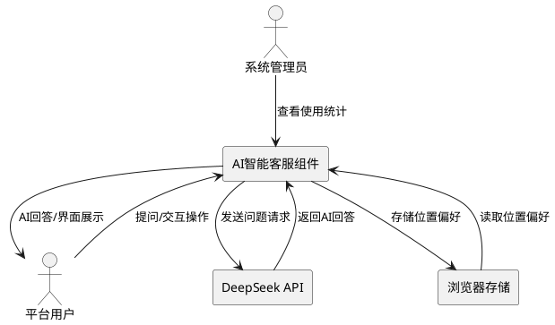
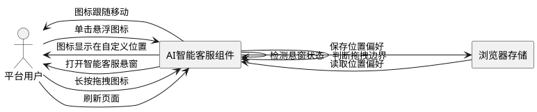
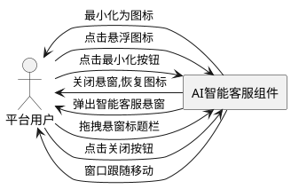
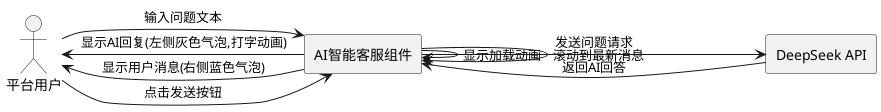
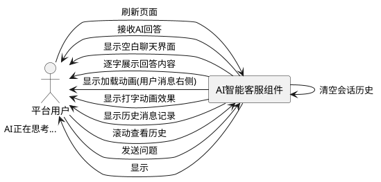
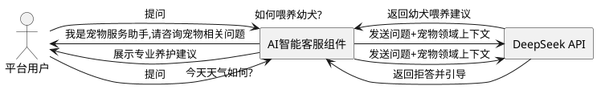

# **1. 组件定位**

## **1.1 核心职责**

本组件负责为用户提供AI智能客服问答服务，实现宠物养护知识的智能咨询与即时响应。

## **1.2 核心输入**

1. **用户提问请求**：来自前端用户输入的宠物相关问题
2. **用户交互操作**：用户对悬浮图标的点击、拖拽等操作指令
3. **DeepSeek API响应**：DeepSeek AI服务返回的回答内容
4. **用户位置偏好**：用户自定义的悬浮图标位置数据

## **1.3 核心输出**

1. **AI回答内容**：返回给用户的智能回答文本
2. **悬浮UI组件**：展示给用户的悬浮图标和聊天窗口界面
3. **用户位置存储**：保存到浏览器的图标位置偏好数据
4. **交互反馈**：加载状态、错误提示等用户界面反馈

## **1.4 职责边界**

本组件不负责：
- 用户账户认证与权限管理（由用户管理组件负责）
- 宠物服务订单处理（由订单管理组件负责）
- 宠物信息存储与管理（由宠物档案组件负责）
- 平台运营数据分析（由数据分析组件负责）
- DeepSeek API密钥管理与计费（由第三方集成组件负责）

# **2. 领域术语**

**AI智能客服**
: 基于DeepSeek API的智能问答系统,为用户提供宠物领域的知识咨询和问题解答服务。

**悬浮图标**
: 固定在页面右侧边缘的可交互图标组件,作为智能客服的入口,支持点击打开和拖拽移动。
: 备注：也称为"智能客服入口图标"。

**智能客服悬窗**
: 点击悬浮图标后弹出的聊天窗口界面,包含消息输入、展示和交互功能。
: 备注：也称为"客服聊天窗口"。

**会话历史**
: 当前用户与AI客服的对话记录,包含用户提问和AI回答的完整消息序列。

**位置偏好**
: 用户自定义的悬浮图标在页面中的坐标位置,用于持久化用户的个性化布局。

**打字动画**
: AI回复时模拟逐字输出的视觉效果,用于提升用户体验和交互真实感。

**快捷问题**
: 预设的常见问题按钮,用户点击后可快速发送问题,无需手动输入。

# **3. 角色与边界**

## **3.1 核心角色**

**平台用户**：使用宠物服务平台的宠物主人或潜在领养者,需要获取宠物养护知识和问题咨询。

**系统管理员**：管理平台运营的人员,可监控AI客服使用情况和常见问题统计。

## **3.2 外部系统**

**DeepSeek API**：第三方AI服务接口,提供智能问答能力,接收问题并返回AI生成的回答。

**浏览器本地存储**：前端存储用户位置偏好和会话历史数据。

## **3.3 交互上下文**



# **4. DFX约束**

## **4.1 性能**

1. **API响应时间**：DeepSeek API调用响应时间应不超过5秒
   - 验收条件：[用户发送问题] → [5秒内显示AI回答或加载状态]

2. **界面响应速度**：用户界面操作响应时间应不超过200毫秒
   - 验收条件：[用户点击/拖拽] → [200ms内完成视觉反馈]

3. **消息渲染性能**：单次消息渲染时间应不超过100毫秒
   - 验收条件：[接收AI回答] → [100ms内完成消息展示]

## **4.2 可靠性**

1. **API容错机制**：当DeepSeek API调用失败时,系统应提供友好的错误提示并允许重试
   - 验收条件：[API调用失败] → [显示错误提示并提供重试选项]

2. **数据持久性**：用户位置偏好应持久化保存,刷新页面后保持不变
   - 验收条件：[用户移动图标位置并刷新] → [图标位置保持用户设置]

3. **会话完整性**：当前会话历史应完整保存,支持滚动查看所有消息
   - 验收条件：[用户进行多轮对话] → [所有历史消息均可查看]

## **4.3 安全性**

1. **输入内容过滤**：系统应对用户输入进行XSS过滤,防止恶意脚本注入
   - 验收条件：[用户输入包含脚本标签] → [脚本标签被过滤不执行]

2. **API密钥保护**：DeepSeek API密钥应存储在后端,不应暴露给前端
   - 验收条件：[前端代码检查] → [不包含明文API密钥]

3. **访问频率限制**：系统应对用户提问频率进行限制,防止恶意刷接口
   - 验收条件：[用户连续发送超过20条消息/分钟] → [触发频率限制提示]

## **4.4 可维护性**

1. **错误日志记录**：API调用失败、异常情况应记录详细日志,包含时间、用户ID、错误信息
   - 验收条件：[发生异常] → [日志记录完整异常信息]

2. **配置可管理**：快捷问题列表、上下文提示词应支持配置管理,无需修改代码即可调整
   - 验收条件：[管理员修改配置] → [配置生效无需重启]

3. **监控指标接入**：应接入调用次数、响应时间、成功率等监控指标
   - 验收条件：[系统运行] → [监控指标正常上报]

## **4.5 兼容性**

1. **浏览器兼容**：应支持主流浏览器（Chrome、Firefox、Edge、Safari）的最新两个主版本
   - 验收条件：[在支持的浏览器中访问] → [功能正常运行无样式错乱]

2. **移动端适配**：悬窗尺寸和交互应适配移动端屏幕尺寸
   - 验收条件：[移动设备访问] → [悬窗尺寸自适应屏幕]

# **5. 核心能力**

## **5.1 悬浮图标交互**

### **5.1.1 业务规则**

1. **图标默认位置规则**：悬浮图标默认应固定在页面右侧边缘,距离页面顶部50%的位置
   - 验收条件：[首次访问页面] → [图标显示在页面右侧边缘垂直居中位置]

2. **图标点击规则**：当用户单击悬浮图标时,系统应打开智能客服悬窗
   - 验收条件：[用户单击悬浮图标] → [智能客服悬窗弹出显示]

3. **图标拖拽规则**：当用户长按并拖拽悬浮图标时,系统应允许图标在页面范围内移动
   - 验收条件：[用户长按并拖拽图标] → [图标跟随鼠标移动不超出页面边界]

4. **位置记忆规则**：当用户移动图标位置后,系统应记住用户自定义的位置,刷新页面后保持该位置
   - 验收条件：[用户移动图标位置并刷新页面] → [图标显示在用户上次设置的位置]

5. **禁止项**：悬浮图标不应遮挡页面核心内容区域（如导航栏、主要内容区）
   - 验收条件：[图标拖拽到页面核心区域] → [自动吸附到页面边缘不遮挡内容]

### **5.1.2 交互流程**



### **5.1.3 异常场景**

1. **拖拽超出边界**
   - 触发条件：[用户拖拽图标超出页面可视区域边界]
   - 系统行为：[限制图标位置在页面边界内,自动吸附到最近的有效位置]
   - 用户感知：[图标固定在页面边缘,不超出屏幕]

2. **位置数据损坏**
   - 触发条件：[浏览器存储的位置偏好数据格式错误或损坏]
   - 系统行为：[清除损坏数据,使用默认位置]
   - 用户感知：[图标显示在默认位置,无错误提示]

3. **触摸设备兼容**
   - 触发条件：[在触摸屏设备上用户尝试拖拽图标]
   - 系统行为：[识别触摸事件,支持触摸拖拽]
   - 用户感知：[触摸拖拽功能正常,体验流畅]

## **5.2 智能客服悬窗管理**

### **5.2.1 业务规则**

1. **窗口打开规则**：当用户点击悬浮图标时,系统应从图标位置右侧弹出智能客服悬窗
   - 验收条件：[用户点击悬浮图标] → [悬窗从右侧滑入显示]

2. **窗口尺寸规则**：智能客服悬窗的宽度应为400px,高度应为500px
   - 验收条件：[悬窗打开] → [悬窗宽度400px且高度500px]

3. **窗口关闭规则**：当用户点击关闭按钮时,系统应关闭智能客服悬窗并恢复到图标状态
   - 验收条件：[用户点击关闭按钮] → [悬窗关闭,图标显示]

4. **窗口最小化规则**：当用户点击最小化按钮时,系统应将悬窗最小化为悬浮图标状态
   - 验收条件：[用户点击最小化按钮] → [悬窗最小化为图标,会话历史保留]

5. **窗口拖拽规则**：当用户拖拽悬窗标题栏时,系统应允许窗口在页面范围内移动
   - 验收条件：[用户拖拽悬窗标题栏] → [窗口跟随移动不超出页面边界]

6. **禁止项**：悬窗不应自动关闭,除非用户主动点击关闭或最小化按钮
   - 验收条件：[用户未点击关闭按钮] → [悬窗保持打开状态]

### **5.2.2 交互流程**



### **5.2.3 异常场景**

1. **窗口超出视口**
   - 触发条件：[用户拖拽悬窗导致窗口超出页面视口]
   - 系统行为：[限制窗口位置在视口范围内]
   - 用户感知：[窗口固定在视口边缘,不超出屏幕]

2. **多层弹窗冲突**
   - 触发条件：[页面已有其他弹窗,用户打开智能客服悬窗]
   - 系统行为：[智能客服悬窗应置顶显示]
   - 用户感知：[智能客服悬窗完整显示在最上层]

3. **移动端尺寸适配**
   - 触发条件：[在移动设备上打开悬窗]
   - 系统行为：[调整悬窗尺寸适配屏幕,宽度占屏幕80%,高度占屏幕70%]
   - 用户感知：[悬窗尺寸合适,不影响页面浏览]

## **5.3 聊天交互**

### **5.3.1 业务规则**

1. **消息输入规则**：系统应提供消息输入框,支持用户输入文本内容提问
   - 验收条件：[用户在输入框输入文本] → [文本正常显示在输入框中]

2. **消息发送规则**：当用户点击发送按钮或按Enter键时,系统应发送用户消息到AI
   - 验收条件：[用户输入问题并点击发送] → [消息发送,AI开始处理]

3. **用户消息展示规则**：用户发送的消息应显示在消息区域的右侧,使用蓝色气泡样式
   - 验收条件：[用户发送消息] → [消息显示在右侧蓝色气泡中]

4. **AI回复展示规则**：AI返回的回答应显示在消息区域的左侧,使用灰色气泡样式
   - 验收条件：[AI返回回答] → [回答显示在左侧灰色气泡中]

5. **消息滚动规则**：当消息超过展示区域高度时,系统应支持滚动查看历史消息
   - 验收条件：[消息超过展示区域高度] → [显示滚动条,可滚动查看]

6. **新消息定位规则**：当有新消息时,系统应自动滚动到最新消息位置
   - 验收条件：[收到新消息] → [自动滚动到最新消息]

7. **快捷问题发送规则**：当用户点击快捷问题按钮时,系统应自动发送该问题到AI
   - 验收条件：[用户点击"如何喂养幼犬?"按钮] → [问题自动发送到AI]

8. **禁止项**：系统不应发送空消息或仅包含空白字符的消息
   - 验收条件：[用户输入空内容并点击发送] → [不发送消息,提示用户输入内容]

### **5.3.2 交互流程**



### **5.3.3 异常场景**

1. **输入内容过长**
   - 触发条件：[用户输入超过1000字符的问题]
   - 系统行为：[提示用户输入内容过长,限制在1000字符内]
   - 用户感知：[显示"问题内容过长,请控制在1000字符以内"提示]

2. **连续快速发送**
   - 触发条件：[用户在5秒内连续发送多条消息]
   - 系统行为：[限制发送频率,提示用户稍后再试]
   - 用户感知：[显示"发送过快,请稍后再试"提示]

3. **快捷问题重复点击**
   - 触发条件：[用户连续点击同一快捷问题按钮]
   - 系统行为：[忽略重复点击,只发送一次问题]
   - 用户感知：[不会重复发送相同问题]

## **5.4 DeepSeek API集成**

### **5.4.1 业务规则**

1. **API调用规则**：当用户发送问题时,系统应调用DeepSeek API获取AI回答
   - 验收条件：[用户发送问题] → [系统调用DeepSeek API]

2. **上下文提示词规则**：系统应在调用API时设置宠物领域上下文提示词,限定AI回答范围为宠物相关知识
   - 验收条件：[调用DeepSeek API] → [包含宠物领域上下文提示词]

3. **回答格式规则**：系统应对API返回的回答内容进行格式化处理,确保正确显示
   - 验收条件：[API返回包含特殊字符的回答] → [正确格式化显示无乱码]

4. **API超时规则**：当API调用超过15秒未响应时,系统应判定为超时并提示用户
   - 验收条件：[API调用超过15秒] → [取消调用,提示"请求超时,请重试"]

5. **API重试规则**：当API调用失败时,系统应提供重试按钮,允许用户重新发送问题
   - 验收条件：[API调用失败] → [显示重试按钮]

6. **禁止项**：系统不应将用户的隐私信息（如手机号、身份证）发送到DeepSeek API
   - 验收条件：[用户输入包含手机号] → [手机号被脱敏处理后再发送]

### **5.4.2 交互流程**

```plantuml
@startuml
actor "平台用户" as User
rectangle "AI智能客服组件" as AIComponent
rectangle "DeepSeek API" as DeepSeek

User -> AIComponent : 发送问题
AIComponent -> AIComponent : 构建请求参数(问题+上下文提示词)
AIComponent -> DeepSeek : 调用API接口
alt API调用成功
    DeepSeek -> AIComponent : 返回AI回答
    AIComponent -> AIComponent : 格式化回答内容
    AIComponent -> User : 展示AI回答
else API调用失败
    DeepSeek -> AIComponent : 返回错误信息
    AIComponent -> User : 显示错误提示+重试按钮
end

@enduml
```

### **5.4.3 异常场景**

1. **API服务不可用**
   - 触发条件：[DeepSeek API服务宕机或网络不通]
   - 系统行为：[捕获异常,记录错误日志,返回友好错误提示]
   - 用户感知：[显示"AI客服暂时不可用,请稍后再试或联系客服"]

2. **API返回格式错误**
   - 触发条件：[DeepSeek API返回的数据格式不符合预期]
   - 系统行为：[解析失败,使用默认错误提示]
   - 用户感知：[显示"AI回复异常,请重试"]

3. **API响应超时**
   - 触发条件：[API调用超过15秒未响应]
   - 系统行为：[取消请求,记录超时日志]
   - 用户感知：[显示"请求超时,请检查网络后重试"]

4. **API调用频率限制**
   - 触发条件：[触发DeepSeek API频率限制]
   - 系统行为：[等待冷却时间后重试]
   - 用户感知：[显示"AI客服繁忙,请稍后再试"]

## **5.5 用户体验增强**

### **5.5.1 业务规则**

1. **打字动画规则**：当AI回复消息时,系统应显示打字动画效果,逐字展示回答内容
   - 验收条件：[AI回复消息] → [显示逐字打印效果]

2. **加载状态规则**：当API调用处理中时,系统应显示loading动画提示用户等待
   - 验收条件：[API调用中] → [显示加载动画]

3. **错误提示规则**：当发生错误时,系统应显示友好的错误提示信息,避免技术性错误信息
   - 验收条件：[发生错误] → [显示用户友好的错误提示]

4. **会话历史规则**：系统应保存当前会话的历史消息,支持用户查看历史对话
   - 验收条件：[用户进行多轮对话] → [可滚动查看所有历史消息]

5. **会话清空规则**：当用户刷新页面时,系统应清空当前会话历史
   - 验收条件：[用户刷新页面] → [会话历史清空,重新开始]

6. **禁止项**：系统不应保存用户的历史会话到服务器,仅保存当前会话在浏览器内存中
   - 验收条件：[用户关闭页面或刷新] → [会话历史清空,不持久化]

### **5.5.2 交互流程**



### **5.5.3 异常场景**

1. **打字动画中断**
   - 触发条件：[AI回答较长,用户在打字动画过程中关闭窗口]
   - 系统行为：[停止打字动画,保存完整回答到消息历史]
   - 用户感知：[重新打开窗口时,完整回答已显示]

2. **加载动画异常**
   - 触发条件：[网络断开导致加载状态无法结束]
   - 系统行为：[设置最大加载时间20秒,超时后显示错误提示]
   - 用户感知：[长时间加载后显示"网络异常,请检查连接"]

3. **会话历史过多**
   - 触发条件：[当前会话超过100条消息]
   - 系统行为：[保留最近100条消息,提示用户刷新清空历史]
   - 用户感知：[显示"会话历史较多,建议刷新页面重新开始"]

## **5.6 知识领域限定**

### **5.6.1 业务规则**

1. **宠物养护知识规则**：当用户询问宠物养护相关问题时,系统应提供专业的养护建议
   - 验收条件：[用户询问"如何喂养幼犬?"] → [AI提供幼犬喂养的专业建议]

2. **宠物健康问题规则**：当用户询问宠物健康问题时,系统应提供初步建议并提示就医
   - 验收条件：[用户询问"狗狗呕吐怎么办?"] → [AI提供初步建议并提示尽快就医]

3. **宠物训练技巧规则**：当用户询问宠物训练问题时,系统应提供训练方法和技巧
   - 验收条件：[用户询问"如何训练猫咪使用猫砂?"] → [AI提供训练步骤和技巧]

4. **宠物领养流程规则**：当用户询问领养流程时,系统应提供平台领养指南
   - 验收条件：[用户询问"如何领养宠物?"] → [AI介绍平台领养流程和注意事项]

5. **平台使用指南规则**：当用户询问平台功能时,系统应提供平台使用帮助
   - 验收条件：[用户询问"如何发布寻宠信息?"] → [AI介绍平台功能使用方法]

6. **非宠物领域问题规则**：当用户询问非宠物领域问题时,系统应礼貌拒绝并引导回到宠物话题
   - 验收条件：[用户询问"今天天气如何?"] → [AI提示"我是宠物服务助手,请咨询宠物相关问题"]

### **5.6.2 交互流程**



### **5.6.3 异常场景**

1. **问题领域模糊**
   - 触发条件：[用户询问模糊问题如"怎么办?"]
   - 系统行为：[AI引导用户明确问题领域,询问具体宠物类型和问题]
   - 用户感知：[AI反问"请问您咨询的是哪种宠物的问题?"]

2. **问题超出能力范围**
   - 触发条件：[用户询问需要实时数据的问题如"附近有哪些宠物医院?"]
   - 系统行为：[AI说明能力范围,建议用户使用平台相关功能]
   - 用户感知：[AI提示"建议您使用平台的宠物医院查询功能"]

# **6. 数据约束**

## **6.1 用户提问消息**

1. **消息内容**：必填,长度不超过1000字符,不能仅包含空白字符
2. **发送时间**：必填,记录消息发送的时间戳
3. **消息类型**：必填,标识为用户消息(USER)或AI消息(AI)
4. **消息状态**：必填,标识为发送中(SENDING)、成功(SUCCESS)、失败(FAILED)

## **6.2 AI回答消息**

1. **回答内容**：必填,AI生成的回答文本,长度不超过2000字符
2. **生成时间**：必填,记录AI回答生成的时间戳
3. **消息类型**：必填,标识为AI消息(AI)
4. **回答状态**：必填,标识为成功(SUCCESS)、失败(FAILED)、超时(TIMEOUT)

## **6.3 悬浮图标位置**

1. **X坐标**：必填,图标距离页面左边的像素值,范围0至页面宽度-图标宽度
2. **Y坐标**：必填,图标距离页面顶部的像素值,范围0至页面高度-图标高度
3. **更新时间**：必填,记录位置最后更新的时间戳

## **6.4 快捷问题项**

1. **问题文本**：必填,快捷按钮显示的问题文本,长度不超过50字符
2. **排序序号**：必填,按钮显示的排序序号,用于控制按钮顺序
3. **启用状态**：必填,标识快捷问题是否启用(ENABLED/DISABLED)

## **6.5 会话历史记录**

1. **会话ID**：必填,当前会话的唯一标识,每次打开窗口生成新会话ID
2. **消息列表**：必填,包含用户消息和AI消息的有序列表
3. **会话状态**：必填,标识会话为进行中(ACTIVE)、已结束(CLOSED)
4. **创建时间**：必填,会话创建的时间戳
