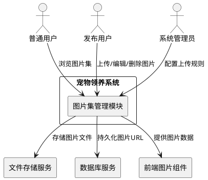
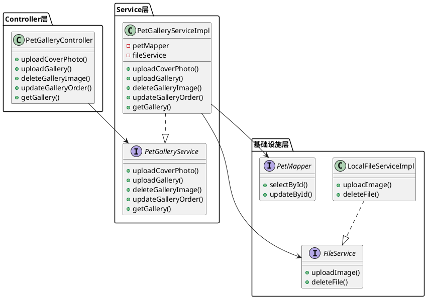
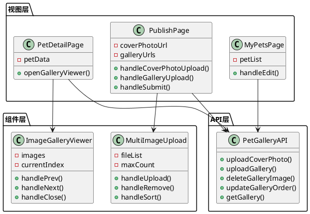
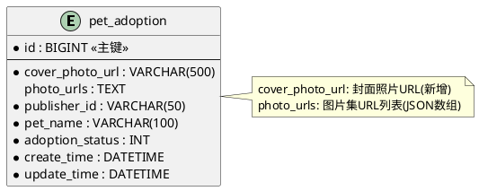

# 宠物图片集功能技术实现方案

# **1. 实现模型**

## **1.1 上下文视图**

### 系统上下文



### 组件职责

| 组件 | 核心职责 | 边界说明 |
|------|---------|---------|
| **图片上传控制器** | 接收图片上传请求,校验文件格式和大小,调用文件服务存储 | 不负责业务逻辑,仅做请求转发和参数校验 |
| **图片管理服务** | 处理图片业务逻辑,包括封面照片和图片集的管理、排序、删除 | 不负责文件存储,依赖FileService |
| **文件存储服务** | 处理图片文件的物理存储,生成访问URL | 已存在,复用LocalFileServiceImpl |
| **前端图片上传组件** | 提供图片选择、预览、拖拽排序等交互功能 | 不负责文件上传,仅处理UI交互 |
| **前端图片浏览组件** | 提供大图预览、左右切换、缩略图导航功能 | 不负责数据获取,仅处理展示逻辑 |

## **1.2 服务/组件总体架构**

### 后端架构



### 前端架构



### 技术选型

| 技术栈 | 组件/框架 | 版本 | 用途 |
|-------|----------|------|------|
| **后端框架** | Spring Boot | 2.3.12 | 提供RESTful API |
| **ORM框架** | MyBatis-Plus | 3.4.3 | 数据库访问 |
| **数据库** | MySQL | 5.7+ | 存储图片URL信息 |
| **文件存储** | 本地文件系统 | - | 存储图片文件(已存在) |
| **前端框架** | Vue.js | 2.6 | 前端MVVM框架 |
| **UI组件库** | Element UI | 2.15 | Upload、Dialog等组件 |
| **拖拽排序** | vuedraggable | 2.24 | 图片拖拽排序功能 |
| **图片懒加载** | vue-lazyload | 1.3 | 图片懒加载优化 |

## **1.3 实现设计文档**

### 1.3.1 后端实现设计

#### (1) 数据库表结构设计

**pet_adoption表字段扩展**

```sql
-- 新增封面照片字段
ALTER TABLE pet_adoption 
ADD COLUMN cover_photo_url VARCHAR(500) COMMENT '封面照片URL' AFTER photo_urls;

-- 修改photo_urls字段用途为图片集
ALTER TABLE pet_adoption 
MODIFY COLUMN photo_urls TEXT COMMENT '图片集URL列表(JSON数组格式)';

-- 添加索引优化查询
CREATE INDEX idx_cover_photo ON pet_adoption(cover_photo_url);
```

**字段说明**

| 字段名 | 类型 | 长度 | 必填 | 说明 |
|-------|------|------|------|------|
| id | BIGINT | - | 是 | 主键ID |
| cover_photo_url | VARCHAR | 500 | 是 | 封面照片URL |
| photo_urls | TEXT | - | 否 | 图片集URL列表,JSON数组格式,最多9个URL |
| update_time | DATETIME | - | 是 | 最后更新时间 |

**数据迁移脚本**

```sql
-- 数据迁移:将存量photo_urls数据迁移到cover_photo_url字段
UPDATE pet_adoption 
SET cover_photo_url = SUBSTRING_INDEX(photo_urls, ',', 1),
    photo_urls = CASE 
        WHEN LOCATE(',', photo_urls) > 0 
        THEN JSON_ARRAY(
            SUBSTRING(photo_urls, LOCATE(',', photo_urls) + 1)
        )
        ELSE NULL 
    END
WHERE photo_urls IS NOT NULL 
  AND photo_urls != ''
  AND cover_photo_url IS NULL;
```

#### (2) 实体类扩展

**PetAdoption.java字段扩展**

```java
/**
 * 封面照片URL
 */
@TableField("cover_photo_url")
private String coverPhotoUrl;

/**
 * 图片集URL列表(JSON数组格式)
 */
@TableField("photo_urls")
private String photoUrls;
```

#### (3) DTO设计

**CoverPhotoUploadDTO.java**

```java
@Data
public class CoverPhotoUploadDTO {
    @NotBlank(message = "领养信息ID不能为空")
    private Long petId;
    
    @NotNull(message = "文件不能为空")
    private MultipartFile file;
}
```

**GalleryUploadDTO.java**

```java
@Data
public class GalleryUploadDTO {
    @NotBlank(message = "领养信息ID不能为空")
    private Long petId;
    
    @NotEmpty(message = "文件列表不能为空")
    private MultipartFile[] files;
}
```

**GalleryOrderDTO.java**

```java
@Data
public class GalleryOrderDTO {
    @NotEmpty(message = "图片URL列表不能为空")
    @Size(max = 9, message = "图片集最多支持9张图片")
    private List<String> imageUrls;
}
```

#### (4) Controller实现

**PetGalleryController.java**

```java
@Api(tags = "宠物图片集管理")
@RestController
@RequestMapping("/api/pet-adoption")
public class PetGalleryController {
    
    @Autowired
    private PetGalleryService petGalleryService;
    
    /**
     * 上传封面照片
     */
    @PostMapping("/{id}/cover-photo")
    @ApiOperation("上传封面照片")
    public Result<UploadVO> uploadCoverPhoto(
            @PathVariable Long id,
            @RequestParam("file") MultipartFile file) {
        String url = petGalleryService.uploadCoverPhoto(id, file);
        return Result.success(new UploadVO(url));
    }
    
    /**
     * 上传图片集
     */
    @PostMapping("/{id}/gallery")
    @ApiOperation("上传图片集")
    public Result<GalleryUploadVO> uploadGallery(
            @PathVariable Long id,
            @RequestParam("files") MultipartFile[] files) {
        List<String> urls = petGalleryService.uploadGallery(id, files);
        return Result.success(new GalleryUploadVO(urls));
    }
    
    /**
     * 删除图片集中的图片
     */
    @DeleteMapping("/{id}/gallery/{imageIndex}")
    @ApiOperation("删除图片")
    public Result<Void> deleteGalleryImage(
            @PathVariable Long id,
            @PathVariable Integer imageIndex) {
        petGalleryService.deleteGalleryImage(id, imageIndex);
        return Result.success();
    }
    
    /**
     * 更新图片顺序
     */
    @PutMapping("/{id}/gallery/order")
    @ApiOperation("更新图片顺序")
    public Result<Void> updateGalleryOrder(
            @PathVariable Long id,
            @RequestBody @Validated GalleryOrderDTO dto) {
        petGalleryService.updateGalleryOrder(id, dto.getImageUrls());
        return Result.success();
    }
    
    /**
     * 查询图片集
     */
    @GetMapping("/{id}/gallery")
    @ApiOperation("查询图片集")
    public Result<GalleryVO> getGallery(@PathVariable Long id) {
        GalleryVO vo = petGalleryService.getGallery(id);
        return Result.success(vo);
    }
}
```

#### (5) Service实现

**PetGalleryServiceImpl.java核心逻辑**

```java
@Service
public class PetGalleryServiceImpl implements PetGalleryService {
    
    @Autowired
    private PetMapper petMapper;
    
    @Autowired
    private FileService fileService;
    
    private static final int MAX_GALLERY_COUNT = 9;
    
    @Override
    @Transactional(rollbackFor = Exception.class)
    public String uploadCoverPhoto(Long petId, MultipartFile file) {
        // 1. 校验文件格式和大小
        validateImageFile(file);
        
        // 2. 查询领养信息
        PetAdoption pet = petMapper.selectById(petId);
        if (pet == null) {
            throw new BusinessException("领养信息不存在");
        }
        
        // 3. 删除原有封面照片
        if (StringUtils.isNotBlank(pet.getCoverPhotoUrl())) {
            fileService.deleteFile(pet.getCoverPhotoUrl());
        }
        
        // 4. 上传新封面照片
        String url = fileService.uploadImage(file, "cover-photos");
        
        // 5. 更新数据库
        pet.setCoverPhotoUrl(url);
        petMapper.updateById(pet);
        
        return url;
    }
    
    @Override
    @Transactional(rollbackFor = Exception.class)
    public List<String> uploadGallery(Long petId, MultipartFile[] files) {
        // 1. 查询领养信息
        PetAdoption pet = petMapper.selectById(petId);
        if (pet == null) {
            throw new BusinessException("领养信息不存在");
        }
        
        // 2. 获取当前图片集
        List<String> currentUrls = parsePhotoUrls(pet.getPhotoUrls());
        
        // 3. 校验图片数量
        if (currentUrls.size() + files.length > MAX_GALLERY_COUNT) {
            throw new BusinessException("图片集最多支持9张图片");
        }
        
        // 4. 批量上传新图片
        List<String> newUrls = new ArrayList<>();
        for (MultipartFile file : files) {
            validateImageFile(file);
            String url = fileService.uploadImage(file, "gallery");
            newUrls.add(url);
        }
        
        // 5. 合并图片集并更新数据库
        currentUrls.addAll(newUrls);
        pet.setPhotoUrls(toJsonArray(currentUrls));
        petMapper.updateById(pet);
        
        return newUrls;
    }
    
    @Override
    @Transactional(rollbackFor = Exception.class)
    public void deleteGalleryImage(Long petId, Integer imageIndex) {
        // 1. 查询领养信息
        PetAdoption pet = petMapper.selectById(petId);
        if (pet == null) {
            throw new BusinessException("领养信息不存在");
        }
        
        // 2. 解析图片集
        List<String> urls = parsePhotoUrls(pet.getPhotoUrls());
        if (imageIndex < 0 || imageIndex >= urls.size()) {
            throw new BusinessException("图片索引无效");
        }
        
        // 3. 删除图片文件
        String deletedUrl = urls.get(imageIndex);
        fileService.deleteFile(deletedUrl);
        
        // 4. 更新图片集
        urls.remove(imageIndex.intValue());
        pet.setPhotoUrls(urls.isEmpty() ? null : toJsonArray(urls));
        petMapper.updateById(pet);
    }
    
    @Override
    @Transactional(rollbackFor = Exception.class)
    public void updateGalleryOrder(Long petId, List<String> imageUrls) {
        // 1. 查询领养信息
        PetAdoption pet = petMapper.selectById(petId);
        if (pet == null) {
            throw new BusinessException("领养信息不存在");
        }
        
        // 2. 校验图片数量
        if (imageUrls.size() > MAX_GALLERY_COUNT) {
            throw new BusinessException("图片集最多支持9张图片");
        }
        
        // 3. 更新图片顺序
        pet.setPhotoUrls(toJsonArray(imageUrls));
        petMapper.updateById(pet);
    }
    
    // 辅助方法
    private void validateImageFile(MultipartFile file) {
        // 校验文件大小(5MB)
        if (file.getSize() > 5 * 1024 * 1024) {
            throw new BusinessException("图片大小不能超过5MB");
        }
        
        // 校验文件格式
        String filename = file.getOriginalFilename();
        if (!filename.matches(".*\\.(jpg|jpeg|png)$")) {
            throw new BusinessException("仅支持jpg、png、jpeg格式");
        }
    }
    
    private List<String> parsePhotoUrls(String photoUrls) {
        if (StringUtils.isBlank(photoUrls)) {
            return new ArrayList<>();
        }
        // 支持JSON数组和逗号分隔字符串两种格式(向后兼容)
        if (photoUrls.startsWith("[")) {
            return JSON.parseArray(photoUrls, String.class);
        } else {
            return Arrays.asList(photoUrls.split(","));
        }
    }
    
    private String toJsonArray(List<String> urls) {
        return JSON.toJSONString(urls);
    }
}
```

### 1.3.2 前端实现设计

#### (1) 多图上传组件

**MultiImageUpload.vue**

```vue
<template>
  <div class="multi-image-upload">
    <el-upload
      :action="uploadUrl"
      :headers="headers"
      :multiple="multiple"
      :limit="maxCount"
      :file-list="fileList"
      :before-upload="beforeUpload"
      :on-success="handleSuccess"
      :on-remove="handleRemove"
      :on-exceed="handleExceed"
      list-type="picture-card"
      :auto-upload="true">
      <i class="el-icon-plus"></i>
      <div slot="tip" class="el-upload__tip">
        仅支持jpg、png、jpeg格式,单张不超过5MB,最多{{maxCount}}张
      </div>
    </el-upload>
    
    <!-- 拖拽排序 -->
    <draggable 
      v-model="fileList" 
      class="image-list"
      @end="handleSortEnd">
      <div v-for="(file, index) in fileList" :key="file.uid" class="image-item">
        
        <div class="image-actions">
          <i class="el-icon-delete" @click="handleRemove(index)"></i>
        </div>
      </div>
    </draggable>
  </div>
</template>

<script>
import draggable from 'vuedraggable'

export default {
  name: 'MultiImageUpload',
  components: { draggable },
  props: {
    value: Array,  // v-model绑定
    maxCount: {
      type: Number,
      default: 9
    },
    multiple: {
      type: Boolean,
      default: true
    }
  },
  data() {
    return {
      uploadUrl: '/api/file/upload',
      headers: {
        Authorization: localStorage.getItem('token')
      },
      fileList: []
    }
  },
  watch: {
    value: {
      handler(val) {
        this.fileList = (val || []).map(url => ({
          url,
          uid: Math.random()
        }))
      },
      immediate: true
    }
  },
  methods: {
    beforeUpload(file) {
      // 校验文件格式
      const isImage = ['image/jpeg', 'image/jpg', 'image/png'].includes(file.type)
      if (!isImage) {
        this.$message.error('仅支持jpg、png、jpeg格式')
        return false
      }
      
      // 校验文件大小
      const isLt5M = file.size / 1024 / 1024 < 5
      if (!isLt5M) {
        this.$message.error('图片大小不能超过5MB')
        return false
      }
      
      return true
    },
    
    handleSuccess(response, file, fileList) {
      if (response.code === 200) {
        const urls = fileList.map(f => f.response?.data?.url || f.url)
        this.$emit('input', urls.filter(Boolean))
      }
    },
    
    handleRemove(file, fileList) {
      const urls = fileList.map(f => f.response?.data?.url || f.url)
      this.$emit('input', urls.filter(Boolean))
    },
    
    handleExceed(files, fileList) {
      this.$message.warning(`图片集最多支持${this.maxCount}张图片`)
    },
    
    handleSortEnd() {
      const urls = this.fileList.map(f => f.url)
      this.$emit('input', urls)
      this.$emit('sort-change', urls)
    }
  }
}
</script>
```

#### (2) 图片浏览组件

**ImageGalleryViewer.vue**

```vue
<template>
  <el-dialog
    :visible.sync="visible"
    :modal-append-to-body="true"
    :append-to-body="true"
    custom-class="gallery-viewer"
    @close="handleClose">
    
    <!-- 大图预览 -->
    <div class="gallery-main">
      
      
      <!-- 左右切换按钮 -->
      <div class="gallery-prev" @click="handlePrev" v-show="images.length > 1">
        <i class="el-icon-arrow-left"></i>
      </div>
      <div class="gallery-next" @click="handleNext" v-show="images.length > 1">
        <i class="el-icon-arrow-right"></i>
      </div>
    </div>
    
    <!-- 缩略图导航 -->
    <div class="gallery-thumbnails">
      <div 
        v-for="(img, index) in images" 
        :key="index"
        class="thumbnail-item"
        :class="{ active: index === currentIndex }"
        @click="handleThumbnailClick(index)">
        
      </div>
    </div>
    
  </el-dialog>
</template>

<script>
export default {
  name: 'ImageGalleryViewer',
  props: {
    images: Array,  // 图片URL列表
    initialIndex: {
      type: Number,
      default: 0
    }
  },
  data() {
    return {
      visible: false,
      currentIndex: 0
    }
  },
  computed: {
    currentImage() {
      return this.images[this.currentIndex] || ''
    }
  },
  watch: {
    initialIndex: {
      handler(val) {
        this.currentIndex = val
      },
      immediate: true
    }
  },
  methods: {
    open() {
      this.visible = true
      this.bindKeyboardEvents()
    },
    
    close() {
      this.visible = false
      this.unbindKeyboardEvents()
    },
    
    handleClose() {
      this.$emit('close')
    },
    
    handlePrev() {
      this.currentIndex = (this.currentIndex - 1 + this.images.length) % this.images.length
    },
    
    handleNext() {
      this.currentIndex = (this.currentIndex + 1) % this.images.length
    },
    
    handleThumbnailClick(index) {
      this.currentIndex = index
    },
    
    handleImageLoad() {
      // 图片加载完成后的处理
    },
    
    bindKeyboardEvents() {
      document.addEventListener('keydown', this.handleKeydown)
    },
    
    unbindKeyboardEvents() {
      document.removeEventListener('keydown', this.handleKeydown)
    },
    
    handleKeydown(e) {
      if (!this.visible) return
      
      switch(e.key) {
        case 'ArrowLeft':
          this.handlePrev()
          break
        case 'ArrowRight':
          this.handleNext()
          break
        case 'Escape':
          this.close()
          break
      }
    }
  },
  beforeDestroy() {
    this.unbindKeyboardEvents()
  }
}
</script>

<style scoped>
.gallery-viewer {
  width: 90%;
  max-width: 1200px;
}

.gallery-main {
  position: relative;
  width: 100%;
  height: 600px;
  display: flex;
  align-items: center;
  justify-content: center;
  background: #000;
}

.gallery-image {
  max-width: 100%;
  max-height: 100%;
  object-fit: contain;
}

.gallery-prev,
.gallery-next {
  position: absolute;
  top: 50%;
  transform: translateY(-50%);
  width: 50px;
  height: 50px;
  background: rgba(255, 255, 255, 0.3);
  border-radius: 50%;
  display: flex;
  align-items: center;
  justify-content: center;
  cursor: pointer;
  transition: background 0.3s;
}

.gallery-prev:hover,
.gallery-next:hover {
  background: rgba(255, 255, 255, 0.5);
}

.gallery-prev {
  left: 20px;
}

.gallery-next {
  right: 20px;
}

.gallery-thumbnails {
  display: flex;
  gap: 10px;
  padding: 20px;
  overflow-x: auto;
  background: #f5f5f5;
}

.thumbnail-item {
  flex-shrink: 0;
  width: 80px;
  height: 80px;
  border: 2px solid transparent;
  border-radius: 4px;
  overflow: hidden;
  cursor: pointer;
  transition: border-color 0.3s;
}

.thumbnail-item.active {
  border-color: #409eff;
}

.thumbnail-item img {
  width: 100%;
  height: 100%;
  object-fit: cover;
}
</style>
```

#### (3) 发布页面改造

**Publish.vue核心代码**

```vue
<template>
  <div class="publish-page">
    <el-form ref="form" :model="form" :rules="rules" label-width="120px">
      
      <!-- 封面照片上传 -->
      <el-form-item label="封面照片" prop="coverPhotoUrl">
        <el-upload
          class="cover-uploader"
          :action="uploadUrl"
          :headers="headers"
          :show-file-list="false"
          :before-upload="beforeCoverUpload"
          :on-success="handleCoverSuccess">
          
          <i v-else class="el-icon-plus cover-uploader-icon"></i>
        </el-upload>
        <div class="upload-tip">建议上传800x600px尺寸的图片</div>
      </el-form-item>
      
      <!-- 图片集上传 -->
      <el-form-item label="图片集">
        <multi-image-upload 
          v-model="form.galleryUrls"
          :max-count="9"
          @sort-change="handleGallerySort" />
        <div class="upload-tip">最多上传9张图片,可拖拽排序</div>
      </el-form-item>
      
      <!-- 其他表单项... -->
      
    </el-form>
  </div>
</template>

<script>
import MultiImageUpload from '@/components/MultiImageUpload'

export default {
  components: { MultiImageUpload },
  data() {
    return {
      form: {
        coverPhotoUrl: '',
        galleryUrls: [],
        // 其他字段...
      },
      rules: {
        coverPhotoUrl: [
          { required: true, message: '请上传封面照片', trigger: 'change' }
        ]
      }
    }
  },
  methods: {
    beforeCoverUpload(file) {
      const isImage = ['image/jpeg', 'image/jpg', 'image/png'].includes(file.type)
      const isLt5M = file.size / 1024 / 1024 < 5
      
      if (!isImage) {
        this.$message.error('仅支持jpg、png、jpeg格式')
        return false
      }
      if (!isLt5M) {
        this.$message.error('图片大小不能超过5MB')
        return false
      }
      return true
    },
    
    handleCoverSuccess(response) {
      if (response.code === 200) {
        this.form.coverPhotoUrl = response.data.url
      }
    },
    
    handleGallerySort(urls) {
      // 处理图片排序变化
      console.log('Gallery order changed:', urls)
    },
    
    async handleSubmit() {
      // 提交表单
      const params = {
        ...this.form,
        photoUrls: JSON.stringify(this.form.galleryUrls)
      }
      
      // 调用发布/更新接口
      // ...
    }
  }
}
</script>
```

#### (4) 详情页改造

**PetDetail.vue核心代码**

```vue
<template>
  <div class="pet-detail">
    <!-- 封面照片 -->
    <div class="cover-section">
      
    </div>
    
    <!-- 图片集缩略图 -->
    <div v-if="galleryUrls.length > 0" class="gallery-section">
      <h3>图片集({{galleryUrls.length}}张)</h3>
      <div class="gallery-thumbnails">
        <div 
          v-for="(url, index) in galleryUrls" 
          :key="index"
          class="thumbnail-item"
          @click="openGallery(index)">
          
        </div>
      </div>
      <el-button type="text" @click="openGallery(0)">
        查看更多图片 <i class="el-icon-arrow-right"></i>
      </el-button>
    </div>
    
    <!-- 图片浏览组件 -->
    <image-gallery-viewer
      ref="galleryViewer"
      :images="allImages"
      @close="handleGalleryClose" />
  </div>
</template>

<script>
import ImageGalleryViewer from '@/components/ImageGalleryViewer'

export default {
  components: { ImageGalleryViewer },
  data() {
    return {
      petData: {},
      galleryUrls: []
    }
  },
  computed: {
    allImages() {
      // 合并封面照片和图片集
      return [this.petData.coverPhotoUrl, ...this.galleryUrls]
    }
  },
  methods: {
    async loadPetDetail() {
      const res = await this.$api.getPetDetail(this.$route.params.id)
      this.petData = res.data
      
      // 解析图片集
      if (this.petData.photoUrls) {
        try {
          this.galleryUrls = JSON.parse(this.petData.photoUrls)
        } catch (e) {
          // 向后兼容:支持逗号分隔格式
          this.galleryUrls = this.petData.photoUrls.split(',')
        }
      }
    },
    
    openGallery(index) {
      this.$refs.galleryViewer.open()
      this.$refs.galleryViewer.currentIndex = index
    },
    
    handleGalleryClose() {
      // 处理浏览模式关闭
    }
  },
  mounted() {
    this.loadPetDetail()
  }
}
</script>
```

# **2. 接口设计**

## **2.1 总体设计**

### 接口设计原则

1. **RESTful规范**: 遵循RESTful API设计规范,使用HTTP动词表示操作语义
2. **统一响应格式**: 所有接口返回统一的JSON格式 `{code, message, data}`
3. **参数校验**: 使用Spring Validation进行参数校验,确保数据合法性
4. **异常处理**: 统一异常处理,返回友好的错误提示信息
5. **向后兼容**: 支持JSON数组和逗号分隔字符串两种图片URL格式

### 认证与授权

- 所有接口需要JWT Token认证
- 图片上传/删除操作需要校验用户权限(仅允许本人操作)

## **2.2 接口清单**

### 2.2.1 上传封面照片接口

**接口定义**

| 项目 | 说明 |
|------|------|
| 接口路径 | POST /api/pet-adoption/{id}/cover-photo |
| 请求方式 | POST |
| Content-Type | multipart/form-data |
| 认证方式 | JWT Token |
| 接口说明 | 上传宠物领养信息的封面照片,每个领养信息有且仅有一张封面照片 |

**请求参数**

| 参数名 | 类型 | 必填 | 位置 | 说明 |
|-------|------|------|------|------|
| id | Long | 是 | Path | 领养信息ID |
| file | MultipartFile | 是 | Body | 图片文件,仅支持jpg/png/jpeg,不超过5MB |

**响应数据**

```json
{
  "code": 200,
  "message": "上传成功",
  "data": {
    "url": "http://localhost:8080/api/uploads/cover-photos/2026/06/09/abc123.jpg"
  }
}
```

**错误码**

| 错误码 | 说明 |
|-------|------|
| 400 | 文件格式不支持或文件大小超限 |
| 401 | 未授权,需要登录 |
| 403 | 无权限,仅允许本人操作 |
| 404 | 领养信息不存在 |
| 500 | 文件上传失败 |

**业务规则**

1. 上传前校验文件格式(jpg/png/jpeg)和大小(≤5MB)
2. 若已有封面照片,先删除旧文件再上传新文件
3. 上传成功后更新数据库中的cover_photo_url字段

---

### 2.2.2 上传图片集接口

**接口定义**

| 项目 | 说明 |
|------|------|
| 接口路径 | POST /api/pet-adoption/{id}/gallery |
| 请求方式 | POST |
| Content-Type | multipart/form-data |
| 认证方式 | JWT Token |
| 接口说明 | 批量上传图片集,图片集最多包含9张图片 |

**请求参数**

| 参数名 | 类型 | 必填 | 位置 | 说明 |
|-------|------|------|------|------|
| id | Long | 是 | Path | 领养信息ID |
| files | MultipartFile[] | 是 | Body | 图片文件数组,每个文件不超过5MB |

**响应数据**

```json
{
  "code": 200,
  "message": "上传成功",
  "data": {
    "urls": [
      "http://localhost:8080/api/uploads/gallery/2026/06/09/def456.jpg",
      "http://localhost:8080/api/uploads/gallery/2026/06/09/ghi789.jpg"
    ]
  }
}
```

**错误码**

| 错误码 | 说明 |
|-------|------|
| 400 | 文件格式不支持、文件大小超限或图片数量超过限制 |
| 401 | 未授权,需要登录 |
| 403 | 无权限,仅允许本人操作 |
| 404 | 领养信息不存在 |
| 500 | 文件上传失败 |

**业务规则**

1. 上传前校验当前图片集数量+新增数量≤9
2. 每张图片校验格式(jpg/png/jpeg)和大小(≤5MB)
3. 上传成功后将新图片URL追加到photo_urls字段(JSON数组格式)

---

### 2.2.3 删除图片接口

**接口定义**

| 项目 | 说明 |
|------|------|
| 接口路径 | DELETE /api/pet-adoption/{id}/gallery/{imageIndex} |
| 请求方式 | DELETE |
| 认证方式 | JWT Token |
| 接口说明 | 删除图片集中的指定图片 |

**请求参数**

| 参数名 | 类型 | 必填 | 位置 | 说明 |
|-------|------|------|------|------|
| id | Long | 是 | Path | 领养信息ID |
| imageIndex | Integer | 是 | Path | 图片索引(从0开始) |

**响应数据**

```json
{
  "code": 200,
  "message": "删除成功"
}
```

**错误码**

| 错误码 | 说明 |
|-------|------|
| 400 | 图片索引无效 |
| 401 | 未授权,需要登录 |
| 403 | 无权限,仅允许本人操作 |
| 404 | 领养信息不存在 |
| 500 | 删除失败 |

**业务规则**

1. 校验图片索引是否有效(0 ≤ imageIndex < 图片数量)
2. 删除图片文件(调用FileService.deleteFile)
3. 更新photo_urls字段,移除被删除的图片URL

---

### 2.2.4 更新图片顺序接口

**接口定义**

| 项目 | 说明 |
|------|------|
| 接口路径 | PUT /api/pet-adoption/{id}/gallery/order |
| 请求方式 | PUT |
| Content-Type | application/json |
| 认证方式 | JWT Token |
| 接口说明 | 更新图片集中的图片顺序(支持拖拽排序) |

**请求参数**

| 参数名 | 类型 | 必填 | 位置 | 说明 |
|-------|------|------|------|------|
| id | Long | 是 | Path | 领养信息ID |
| imageUrls | List\<String\> | 是 | Body | 排序后的图片URL列表 |

**请求示例**

```json
{
  "imageUrls": [
    "http://localhost:8080/api/uploads/gallery/2026/06/09/img3.jpg",
    "http://localhost:8080/api/uploads/gallery/2026/06/09/img1.jpg",
    "http://localhost:8080/api/uploads/gallery/2026/06/09/img2.jpg"
  ]
}
```

**响应数据**

```json
{
  "code": 200,
  "message": "更新成功"
}
```

**错误码**

| 错误码 | 说明 |
|-------|------|
| 400 | 图片数量超过限制 |
| 401 | 未授权,需要登录 |
| 403 | 无权限,仅允许本人操作 |
| 404 | 领养信息不存在 |

---

### 2.2.5 查询图片集接口

**接口定义**

| 项目 | 说明 |
|------|------|
| 接口路径 | GET /api/pet-adoption/{id}/gallery |
| 请求方式 | GET |
| 认证方式 | JWT Token(可选) |
| 接口说明 | 查询领养信息的封面照片和图片集 |

**请求参数**

| 参数名 | 类型 | 必填 | 位置 | 说明 |
|-------|------|------|------|------|
| id | Long | 是 | Path | 领养信息ID |

**响应数据**

```json
{
  "code": 200,
  "message": "查询成功",
  "data": {
    "coverPhotoUrl": "http://localhost:8080/api/uploads/cover-photos/2026/06/09/abc123.jpg",
    "galleryUrls": [
      "http://localhost:8080/api/uploads/gallery/2026/06/09/def456.jpg",
      "http://localhost:8080/api/uploads/gallery/2026/06/09/ghi789.jpg"
    ]
  }
}
```

**错误码**

| 错误码 | 说明 |
|-------|------|
| 404 | 领养信息不存在 |

**业务规则**

1. 解析photo_urls字段,支持JSON数组和逗号分隔字符串两种格式
2. 返回cover_photo_url和解析后的图片集URL列表

---

### 2.2.6 修改发布接口

**接口定义**

| 项目 | 说明 |
|------|------|
| 接口路径 | POST /api/pet-adoption/publish |
| 请求方式 | POST |
| Content-Type | application/json |
| 认证方式 | JWT Token |
| 接口说明 | 发布领养信息(扩展支持封面照片和图片集) |

**请求参数扩展**

| 参数名 | 类型 | 必填 | 说明 |
|-------|------|------|------|
| coverPhotoUrl | String | 是 | 封面照片URL |
| photoUrls | String | 否 | 图片集URL列表(JSON数组格式) |

**业务规则扩展**

1. 校验coverPhotoUrl必填
2. 校验photoUrls中图片数量≤9
3. 保存时将coverPhotoUrl存入cover_photo_url字段,photoUrls存入photo_urls字段

---

### 2.2.7 修改更新接口

**接口定义**

| 项目 | 说明 |
|------|------|
| 接口路径 | PUT /api/pet-adoption/{id} |
| 请求方式 | PUT |
| Content-Type | application/json |
| 认证方式 | JWT Token |
| 接口说明 | 更新领养信息(扩展支持封面照片和图片集) |

**请求参数扩展**

| 参数名 | 类型 | 必填 | 说明 |
|-------|------|------|------|
| coverPhotoUrl | String | 是 | 封面照片URL |
| photoUrls | String | 否 | 图片集URL列表(JSON数组格式) |

**业务规则扩展**

1. 校验coverPhotoUrl必填
2. 校验photoUrls中图片数量≤9
3. 若coverPhotoUrl发生变化,删除旧封面照片文件
4. 更新cover_photo_url和photo_urls字段

# **4. 数据模型**

## **4.1 设计目标**

### 数据模型设计原则

1. **向后兼容**: 支持存量数据(photo_urls字段)平滑迁移
2. **数据一致性**: 确保图片URL与物理文件的一致性
3. **存储效率**: 使用JSON数组格式存储图片集,减少冗余
4. **查询性能**: 为常用查询字段添加索引

### 数据模型关系



## **4.2 模型实现**

### 4.2.1 数据库表结构

**pet_adoption表结构(扩展后)**

```sql
CREATE TABLE `pet_adoption` (
  `id` bigint(20) NOT NULL AUTO_INCREMENT COMMENT '主键ID',
  `pet_id` varchar(50) DEFAULT NULL COMMENT '宠物ID',
  `publisher_id` varchar(50) NOT NULL COMMENT '发布者ID',
  `pet_name` varchar(100) NOT NULL COMMENT '宠物名称',
  `category_id` int(11) DEFAULT NULL COMMENT '分类ID',
  `pet_status` int(11) DEFAULT NULL COMMENT '宠物状态',
  `age` int(11) DEFAULT NULL COMMENT '年龄(月)',
  `gender` int(11) DEFAULT NULL COMMENT '性别(0:未知 1:公 2:母)',
  `color` varchar(50) DEFAULT NULL COMMENT '颜色',
  `weight` decimal(10,2) DEFAULT NULL COMMENT '体重(kg)',
  `description` text COMMENT '描述',
  `photo_urls` text COMMENT '图片集URL列表(JSON数组格式)',
  `cover_photo_url` varchar(500) DEFAULT NULL COMMENT '封面照片URL',
  `province` varchar(50) DEFAULT NULL COMMENT '省',
  `city` varchar(50) DEFAULT NULL COMMENT '市',
  `district` varchar(50) DEFAULT NULL COMMENT '区',
  `address` varchar(200) DEFAULT NULL COMMENT '详细地址',
  `contact_name` varchar(50) DEFAULT NULL COMMENT '联系人姓名',
  `contact_phone` varchar(20) DEFAULT NULL COMMENT '联系电话',
  `contact_wechat` varchar(50) DEFAULT NULL COMMENT '联系微信',
  `adoption_status` int(11) DEFAULT '0' COMMENT '领养状态(0:可领养 1:已预定 2:已领养)',
  `view_count` int(11) DEFAULT '0' COMMENT '浏览次数',
  `like_count` int(11) DEFAULT '0' COMMENT '收藏次数',
  `create_time` datetime DEFAULT CURRENT_TIMESTAMP COMMENT '创建时间',
  `update_time` datetime DEFAULT CURRENT_TIMESTAMP ON UPDATE CURRENT_TIMESTAMP COMMENT '更新时间',
  `deleted` int(11) DEFAULT '0' COMMENT '逻辑删除标记',
  PRIMARY KEY (`id`),
  KEY `idx_publisher_id` (`publisher_id`),
  KEY `idx_adoption_status` (`adoption_status`),
  KEY `idx_cover_photo` (`cover_photo_url`(255))
) ENGINE=InnoDB DEFAULT CHARSET=utf8mb4 COMMENT='宠物领养信息表';
```

**字段变更说明**

| 变更类型 | 字段名 | 变更说明 |
|---------|-------|---------|
| 新增 | cover_photo_url | 新增封面照片URL字段,必填 |
| 修改 | photo_urls | 修改用途为图片集URL列表,可选,存储JSON数组格式 |

### 4.2.2 实体类设计

**PetAdoption.java(扩展后)**

```java
@Data
@TableName("pet_adoption")
public class PetAdoption implements Serializable {
    
    private static final long serialVersionUID = 1L;
    
    @TableId(type = IdType.AUTO)
    private Long id;
    
    @TableField("pet_id")
    private String petId;
    
    @TableField("publisher_id")
    private String publisherId;
    
    @TableField("pet_name")
    private String petName;
    
    @TableField("category_id")
    private Integer categoryId;
    
    @TableField("pet_status")
    private Integer petStatus;
    
    private Integer age;
    
    private Integer gender;
    
    private String color;
    
    private BigDecimal weight;
    
    private String description;
    
    /**
     * 图片集URL列表(JSON数组格式)
     */
    @TableField("photo_urls")
    private String photoUrls;
    
    /**
     * 封面照片URL
     */
    @TableField("cover_photo_url")
    private String coverPhotoUrl;
    
    private String province;
    
    private String city;
    
    private String district;
    
    private String address;
    
    @TableField("contact_name")
    private String contactName;
    
    @TableField("contact_phone")
    private String contactPhone;
    
    @TableField("contact_wechat")
    private String contactWechat;
    
    @TableField("adoption_status")
    private Integer adoptionStatus;
    
    @TableField("view_count")
    private Integer viewCount;
    
    @TableField("like_count")
    private Integer likeCount;
    
    @TableField(fill = FieldFill.INSERT)
    private LocalDateTime createTime;
    
    @TableField(fill = FieldFill.INSERT_UPDATE)
    private LocalDateTime updateTime;
    
    @TableLogic
    private Integer deleted;
    
    // ===== 业务方法 =====
    
    /**
     * 获取图片集URL列表
     */
    @TableField(exist = false)
    public List<String> getGalleryUrls() {
        if (StringUtils.isBlank(photoUrls)) {
            return new ArrayList<>();
        }
        
        try {
            // 优先尝试JSON数组格式
            if (photoUrls.startsWith("[")) {
                return JSON.parseArray(photoUrls, String.class);
            }
            // 向后兼容:逗号分隔格式
            return Arrays.asList(photoUrls.split(","));
        } catch (Exception e) {
            return new ArrayList<>();
        }
    }
    
    /**
     * 设置图片集URL列表
     */
    @TableField(exist = false)
    public void setGalleryUrls(List<String> urls) {
        if (urls == null || urls.isEmpty()) {
            this.photoUrls = null;
        } else {
            this.photoUrls = JSON.toJSONString(urls);
        }
    }
}
```

### 4.2.3 DTO设计

**GalleryVO.java**

```java
@Data
public class GalleryVO {
    /**
     * 封面照片URL
     */
    private String coverPhotoUrl;
    
    /**
     * 图片集URL列表
     */
    private List<String> galleryUrls;
}
```

**UploadVO.java**

```java
@Data
@AllArgsConstructor
public class UploadVO {
    /**
     * 图片URL
     */
    private String url;
}
```

**GalleryUploadVO.java**

```java
@Data
@AllArgsConstructor
public class GalleryUploadVO {
    /**
     * 图片URL列表
     */
    private List<String> urls;
}
```

### 4.2.4 数据迁移方案

**迁移脚本(V1.0.0__Add_Cover_Photo_Field.sql)**

```sql
-- 1. 新增封面照片字段
ALTER TABLE pet_adoption 
ADD COLUMN cover_photo_url VARCHAR(500) COMMENT '封面照片URL' AFTER description;

-- 2. 数据迁移:将存量photo_urls数据迁移到cover_photo_url字段
UPDATE pet_adoption 
SET cover_photo_url = 
    CASE 
        WHEN photo_urls LIKE '%,%' THEN SUBSTRING_INDEX(photo_urls, ',', 1)
        WHEN photo_urls IS NOT NULL AND photo_urls != '' THEN photo_urls
        ELSE NULL 
    END,
photo_urls = 
    CASE 
        WHEN photo_urls LIKE '%,%' THEN 
            JSON_ARRAY(
                SUBSTRING(photo_urls, LENGTH(SUBSTRING_INDEX(photo_urls, ',', 1)) + 2)
            )
        ELSE NULL 
    END
WHERE photo_urls IS NOT NULL 
  AND photo_urls != ''
  AND cover_photo_url IS NULL;

-- 3. 添加索引
CREATE INDEX idx_cover_photo ON pet_adoption(cover_photo_url(255));

-- 4. 更新表注释
ALTER TABLE pet_adoption 
MODIFY COLUMN photo_urls TEXT COMMENT '图片集URL列表(JSON数组格式)';
```

**迁移说明**

1. **新增字段**: 新增cover_photo_url字段存储封面照片URL
2. **数据迁移**: 
   - 将存量photo_urls字段的第一个URL迁移到cover_photo_url字段
   - 若photo_urls包含多个URL(逗号分隔),则剩余URL转换为JSON数组格式
3. **向后兼容**: 
   - 支持JSON数组和逗号分隔字符串两种格式
   - 前端解析photo_urls时兼容两种格式
4. **索引优化**: 为cover_photo_url字段添加索引优化查询性能

### 4.2.5 文件存储设计

**目录结构**

```
uploads/
├── cover-photos/           # 封面照片目录
│   └── 2026/               # 按年份分组
│       └── 06/             # 按月份分组
│           └── 09/         # 按日期分组
│               ├── abc123.jpg
│               └── def456.jpg
├── gallery/                # 图片集目录
│   └── 2026/
│       └── 06/
│           └── 09/
│               ├── ghi789.jpg
│               └── jkl012.jpg
└── pets/                   # 其他宠物图片(已存在)
```

**文件命名规则**

- 格式: `{UUID}.{extension}`
- 示例: `abc123def456.jpg`
- 保证文件名唯一性,避免冲突

**URL访问路径**

- 封面照片: `http://localhost:8080/api/uploads/cover-photos/2026/06/09/abc123.jpg`
- 图片集: `http://localhost:8080/api/uploads/gallery/2026/06/09/ghi789.jpg`

**静态资源映射配置**

```java
@Configuration
public class WebMvcConfig implements WebMvcConfigurer {
    
    @Value("${file.storage.local.path:uploads}")
    private String uploadPath;
    
    @Override
    public void addResourceHandlers(ResourceHandlerRegistry registry) {
        // 配置静态资源访问路径
        registry.addResourceHandler("/api/uploads/**")
                .addResourceLocations("file:" + uploadPath + "/");
    }
}
```

### 4.2.6 性能优化设计

**图片懒加载**

```javascript
// main.js
import VueLazyload from 'vue-lazyload'

Vue.use(VueLazyload, {
  preLoad: 1.3,
  error: '/static/images/error.png',
  loading: '/static/images/loading.gif',
  attempt: 3
})

// 使用

```

**图片压缩策略**

- 封面照片: 建议尺寸800x600px,压缩质量85%
- 图片集缩略图: 生成200x200px缩略图用于列表展示
- 大图预览: 保持原图尺寸,渐进式加载

**缓存策略**

- 图片文件设置浏览器缓存: Cache-Control: max-age=31536000 (1年)
- 图片URL包含文件hash或时间戳参数,避免缓存问题

---

## 附录

### A. 关键技术点总结

1. **数据库设计**: 新增cover_photo_url字段,修改photo_urls用途为图片集,支持JSON数组格式
2. **后端实现**: 新增PetGalleryController和PetGalleryService,复用LocalFileServiceImpl
3. **前端实现**: 开发MultiImageUpload组件和ImageGalleryViewer组件,改造Publish和PetDetail页面
4. **向后兼容**: 支持JSON数组和逗号分隔字符串两种格式,提供数据迁移脚本
5. **性能优化**: 图片懒加载、缩略图生成、浏览器缓存

### B. 开发任务分解

**后端开发**

- [ ] 数据库表结构扩展和迁移脚本编写
- [ ] PetAdoption实体类扩展
- [ ] PetGalleryController开发
- [ ] PetGalleryService开发
- [ ] DTO和VO类开发
- [ ] 单元测试编写

**前端开发**

- [ ] MultiImageUpload组件开发
- [ ] ImageGalleryViewer组件开发
- [ ] Publish页面改造
- [ ] PetDetail页面改造
- [ ] MyPets页面改造
- [ ] 图片懒加载配置

### C. 验收标准

- [ ] 封面照片上传/替换功能正常
- [ ] 图片集批量上传功能正常(最多9张)
- [ ] 图片删除功能正常
- [ ] 图片拖拽排序功能正常
- [ ] 图片浏览模式正常(大图预览、左右切换、缩略图导航)
- [ ] 主页列表显示封面照片正常
- [ ] 向后兼容性验证通过(支持存量数据)
- [ ] 性能测试通过(上传响应时间<3秒,浏览响应时间<1秒)
