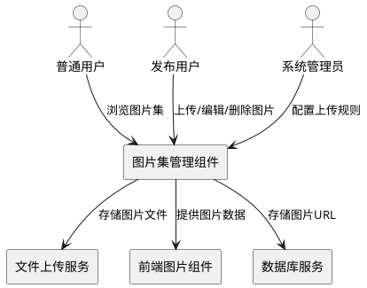
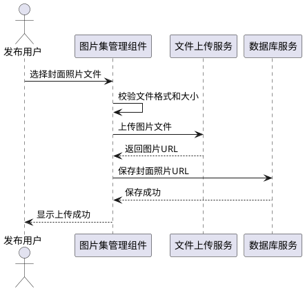
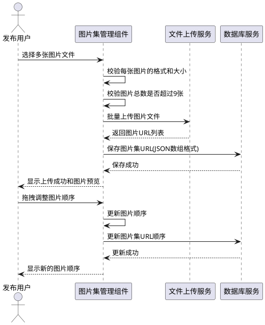
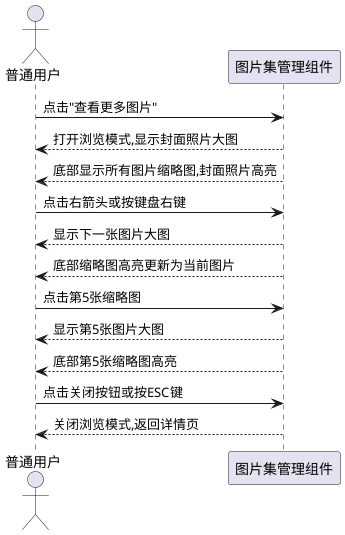
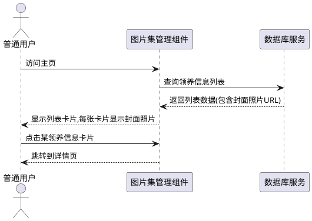
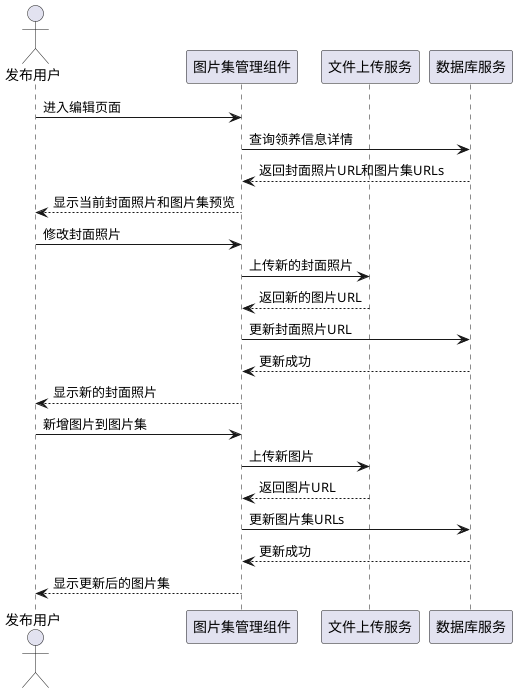

# 宠物图片集功能需求规格

## 1. 组件定位

### 1.1 核心职责
本组件负责宠物领养信息的图片管理能力,实现封面照片与多图片集的上传、展示、浏览和编辑功能,提升宠物领养信息的展示效果和用户体验。

### 1.2 核心输入

1. **用户上传请求**:用户在发布/编辑领养信息时上传封面照片和图片集
2. **图片浏览请求**:用户在详情页查看宠物图片集时的浏览操作
3. **图片删除请求**:用户删除已上传图片的请求
4. **图片排序请求**:用户拖拽调整图片顺序的操作

### 1.3 核心输出

1. **图片上传响应**:返回上传成功/失败状态及图片URL
2. **图片展示数据**:在主页列表和详情页返回图片数据
3. **图片浏览界面**:提供大图预览、缩略图导航等交互界面
4. **错误提示信息**:图片格式、大小、数量不合规时的提示信息

### 1.4 职责边界

本组件**不负责**以下事项:
- 图片的智能裁剪和压缩处理(由前端组件处理)
- 图片的持久化存储管理(由文件服务处理)
- 图片的CDN加速分发(由基础设施层处理)
- 图片内容的智能审核(由独立的审核服务处理)

---

## 2. 领域术语

**封面照片**
: 用于在主页列表展示的宠物主图,每条领养信息有且仅有一张封面照片。
: 备注:建议尺寸800x600px,必填项。

**图片集**
: 用于展示宠物多角度照片的图片集合,最多包含9张图片。
: 备注:可选项,在详情页展示。

**图片浏览模式**
: 提供大图预览、左右切换、缩略图导航的交互模式。
: 备注:支持键盘操作。

**图片URL**
: 图片在服务器上的访问地址,支持HTTP/HTTPS协议。
: 备注:存储在数据库中。

---

## 3. 角色与边界

### 3.1 核心角色

- **普通用户**:浏览宠物信息,查看图片集
- **发布用户**:上传、编辑、删除宠物图片
- **系统管理员**:配置图片上传规则

### 3.2 外部系统

- **文件上传服务**:处理图片文件的存储和访问
- **前端图片组件**:Element UI Upload组件,负责图片预览和拖拽排序
- **数据库服务**:存储图片URL信息

### 3.3 交互上下文



---

## 4. DFX约束

### 4.1 性能

- 单张图片上传响应时间**应不超过**3秒
- 图片集(最多9张)批量上传响应时间**应不超过**15秒
- 图片浏览模式打开时间**应不超过**1秒
- 图片左右切换响应时间**应不超过**200毫秒

### 4.2 可靠性

- 图片上传成功率**应不低于**99%
- 图片URL数据一致性**必须**保证,避免脏数据
- 图片文件存储可靠性**应不低于**99.9%

### 4.3 安全性

- 图片上传接口**必须**进行用户身份认证
- 图片文件大小限制**必须**在服务端校验
- 图片格式限制**必须**在服务端校验
- 图片URL访问**应当**支持防盗链机制

### 4.4 可维护性

- 图片上传失败**必须**记录详细日志(包含用户ID、文件名、错误原因)
- 图片删除操作**应当**记录审计日志
- 图片集浏览行为**可以**记录埋点数据,用于统计分析

### 4.5 兼容性

- 图片集功能**应当**向后兼容,支持仅有photoUrls字段的存量数据
- 图片URL存储格式**应当**支持JSON数组和逗号分隔字符串两种格式
- 前端图片组件**应当**兼容主流浏览器(Chrome、Firefox、Safari、Edge)

---

## 5. 核心能力

### 5.1 封面照片管理

#### 5.1.1 业务规则

1. **封面照片必填规则**:发布领养信息时,封面照片为必填项
   - 验收条件:[用户提交领养信息] → [系统校验封面照片是否已上传,未上传则拒绝提交并提示"请上传封面照片"]

2. **封面照片唯一性规则**:每条领养信息有且仅有一张封面照片
   - 验收条件:[用户重新上传封面照片] → [系统替换原有封面照片,保留最新上传的照片]

3. **封面照片格式规则**:封面照片仅支持jpg、png、jpeg格式
   - 验收条件:[用户上传.bmp格式图片] → [系统拒绝上传并提示"仅支持jpg、png、jpeg格式"]

4. **封面照片大小规则**:单张封面照片大小不超过5MB
   - 验收条件:[用户上传6MB的图片] → [系统拒绝上传并提示"图片大小不能超过5MB"]

5. **封面照片尺寸建议**:建议上传800x600px尺寸的图片
   - 验收条件:[用户上传封面照片] → [系统接受上传,若尺寸不符建议则提示"建议上传800x600px尺寸的图片以获得最佳展示效果"]

#### 5.1.2 交互流程



#### 5.1.3 异常场景

1. **封面照片格式不支持**
   - 触发条件:用户上传非jpg、png、jpeg格式的文件
   - 系统行为:拒绝上传请求,记录错误日志
   - 用户感知:提示"仅支持jpg、png、jpeg格式的图片"

2. **封面照片超过大小限制**
   - 触发条件:用户上传超过5MB的图片文件
   - 系统行为:拒绝上传请求,记录错误日志
   - 用户感知:提示"图片大小不能超过5MB"

3. **封面照片上传失败**
   - 触发条件:文件服务异常或网络故障
   - 系统行为:记录详细错误日志,不更新数据库
   - 用户感知:提示"图片上传失败,请稍后重试"

---

### 5.2 图片集管理

#### 5.2.1 业务规则

1. **图片集数量规则**:图片集最多包含9张图片
   - 验收条件:[用户上传第10张图片] → [系统拒绝上传并提示"图片集最多支持9张图片"]

2. **图片集可选规则**:图片集为可选项,可以不上传
   - 验收条件:[用户不上传图片集] → [系统允许提交领养信息,仅使用封面照片]

3. **图片集格式规则**:图片集仅支持jpg、png、jpeg格式
   - 验收条件:[用户向图片集上传.bmp格式图片] → [系统拒绝上传并提示"仅支持jpg、png、jpeg格式"]

4. **图片集大小规则**:单张图片不超过5MB
   - 验收条件:[用户上传6MB的图片到图片集] → [系统拒绝上传并提示"图片大小不能超过5MB"]

5. **图片集删除规则**:用户可以删除图片集中的任意图片
   - 验收条件:[用户删除图片集中的第3张图片] → [系统移除该图片,其余图片保留]

6. **图片集排序规则**:用户可以拖拽调整图片顺序
   - 验收条件:[用户拖拽第3张图片到第1张位置] → [系统更新图片顺序,第3张变为第1张,原第1、2张依次后移]

#### 5.2.2 交互流程



#### 5.2.3 异常场景

1. **图片集超过数量限制**
   - 触发条件:用户上传图片后总数超过9张
   - 系统行为:拒绝超额上传,记录警告日志
   - 用户感知:提示"图片集最多支持9张图片,当前已有X张"

2. **图片集批量上传部分失败**
   - 触发条件:批量上传9张图片,其中3张上传失败
   - 系统行为:成功上传6张,失败3张,记录详细错误日志
   - 用户感知:提示"成功上传6张图片,3张上传失败,请重试失败的图片"

3. **图片集删除失败**
   - 触发条件:数据库更新异常
   - 系统行为:记录错误日志,保持原状态
   - 用户感知:提示"删除失败,请稍后重试"

---

### 5.3 图片集浏览

#### 5.3.1 业务规则

1. **浏览模式入口规则**:用户点击"查看更多图片"或点击缩略图进入浏览模式
   - 验收条件:[用户点击详情页的缩略图] → [系统打开图片集浏览模式,显示该图片的大图]

2. **大图预览规则**:浏览模式默认显示当前图片的大图
   - 验收条件:[用户点击第3张缩略图] → [系统显示第3张图片的大图]

3. **左右切换规则**:用户可以点击左右箭头或使用键盘左右键切换图片
   - 验收条件:[用户按键盘右箭头] → [系统显示下一张图片的大图]
   - 验收条件:[浏览第9张图片时按右箭头] → [系统循环显示第1张图片]

4. **缩略图导航规则**:浏览模式底部显示所有图片的缩略图,当前图片高亮
   - 验收条件:[浏览模式打开] → [系统在底部显示所有图片的缩略图,当前图片缩略图有高亮边框]

5. **浏览模式退出规则**:用户点击关闭按钮或按ESC键退出浏览模式
   - 验收条件:[用户按ESC键] → [系统关闭浏览模式,返回详情页]

#### 5.3.2 交互流程



#### 5.3.3 异常场景

1. **图片加载失败**
   - 触发条件:图片URL失效或网络故障
   - 系统行为:显示加载失败占位图,记录错误日志
   - 用户感知:显示"图片加载失败"占位图,可继续浏览其他图片

2. **图片集为空**
   - 触发条件:领养信息仅有封面照片,图片集为空
   - 系统行为:不显示"查看更多图片"按钮
   - 用户感知:详情页仅显示封面照片,无图片集入口

---

### 5.4 主页展示

#### 5.4.1 业务规则

1. **列表卡片展示规则**:主页列表卡片使用封面照片展示
   - 验收条件:[主页加载领养信息列表] → [每个卡片显示对应领养信息的封面照片]

2. **卡片点击规则**:用户点击卡片可进入详情页
   - 验收条件:[用户点击某领养信息卡片] → [系统跳转到该领养信息的详情页]

3. **封面照片缺失降级规则**:若封面照片URL失效,显示默认占位图
   - 验收条件:[封面照片URL失效] → [系统显示默认宠物占位图]

#### 5.4.2 交互流程



#### 5.4.3 异常场景

1. **封面照片加载失败**
   - 触发条件:封面照片URL失效或网络故障
   - 系统行为:显示默认占位图,记录错误日志
   - 用户感知:卡片显示默认宠物占位图,不影响列表浏览

---

### 5.5 我的发布页面图片编辑

#### 5.5.1 业务规则

1. **编辑模式图片显示规则**:编辑领养信息时,显示当前已上传的封面照片和图片集
   - 验收条件:[用户进入编辑页面] → [系统显示当前封面照片和图片集的预览]

2. **封面照片修改规则**:用户可以修改封面照片
   - 验收条件:[用户重新上传封面照片] → [系统替换原有封面照片,保存新的封面照片]

3. **图片集修改规则**:用户可以增删图片集中的图片
   - 验收条件:[用户在编辑页面删除图片集中的某张图片] → [系统移除该图片,保存更新后的图片集]
   - 验收条件:[用户在编辑页面新增图片] → [系统添加到图片集,保存更新后的图片集]

4. **图片排序修改规则**:用户可以在编辑页面调整图片顺序
   - 验收条件:[用户拖拽调整图片顺序] → [系统保存新的图片顺序]

#### 5.5.2 交互流程



#### 5.5.3 异常场景

1. **编辑保存失败**
   - 触发条件:数据库更新异常
   - 系统行为:记录错误日志,保持原状态
   - 用户感知:提示"保存失败,请稍后重试"

2. **图片上传失败**
   - 触发条件:文件服务异常或网络故障
   - 系统行为:记录详细错误日志,不更新数据库
   - 用户感知:提示"图片上传失败,请稍后重试"

---

## 6. 数据约束

### 6.1 领养信息(PetAdoption)

1. **id**:领养信息唯一标识,自增长主键,必填
2. **cover_photo_url**:封面照片URL,字符串类型,必填,格式为HTTP/HTTPS URL
3. **photo_urls**:图片集URL列表,字符串类型,可选,格式为JSON数组或逗号分隔的URL字符串,最多包含9个URL
4. **update_time**:最后更新时间,日期时间类型,自动更新

### 6.2 图片上传请求

1. **file**:图片文件,必填,文件类型为jpg、png、jpeg,大小不超过5MB
2. **type**:上传类型,枚举值{COVER_PHOTO, GALLERY},必填,区分封面照片和图片集上传

### 6.3 图片浏览请求

1. **pet_id**:领养信息ID,必填,用于查询图片集
2. **current_index**:当前图片索引,整数类型,可选,默认为0,范围[0, 图片数量-1]

---

## 7. 接口需求

### 7.1 上传封面照片接口

- **接口路径**:POST /api/pet-adoption/{id}/cover-photo
- **请求参数**:MultipartFile file
- **响应数据**:
  ```json
  {
    "code": 200,
    "message": "上传成功",
    "data": {
      "url": "http://localhost:8080/api/uploads/cover-photo-xxx.jpg"
    }
  }
  ```
- **When 用户上传封面照片,系统校验文件格式和大小合法,则图片集管理组件应返回上传成功和图片URL**
- **If 用户上传封面照片格式不合法,则图片集管理组件应返回错误码400和提示"仅支持jpg、png、jpeg格式"**
- **If 用户上传封面照片大小超过5MB,则图片集管理组件应返回错误码400和提示"图片大小不能超过5MB"**

### 7.2 上传图片集接口

- **接口路径**:POST /api/pet-adoption/{id}/gallery
- **请求参数**:MultipartFile[] files
- **响应数据**:
  ```json
  {
    "code": 200,
    "message": "上传成功",
    "data": {
      "urls": [
        "http://localhost:8080/api/uploads/gallery-xxx-1.jpg",
        "http://localhost:8080/api/uploads/gallery-xxx-2.jpg"
      ]
    }
  }
  ```
- **When 用户上传图片集,系统校验每张图片格式和大小合法且总数不超过9张,则图片集管理组件应返回上传成功和图片URL列表**
- **If 用户上传图片集总数超过9张,则图片集管理组件应返回错误码400和提示"图片集最多支持9张图片"**

### 7.3 删除图片接口

- **接口路径**:DELETE /api/pet-adoption/{id}/gallery/{imageIndex}
- **响应数据**:
  ```json
  {
    "code": 200,
    "message": "删除成功"
  }
  ```
- **When 用户删除图片集中的某张图片,则图片集管理组件应移除该图片并返回删除成功**

### 7.4 更新图片顺序接口

- **接口路径**:PUT /api/pet-adoption/{id}/gallery/order
- **请求参数**:
  ```json
  {
    "imageUrls": [
      "url1",
      "url2",
      "url3"
    ]
  }
  ```
- **响应数据**:
  ```json
  {
    "code": 200,
    "message": "更新成功"
  }
  ```
- **When 用户调整图片顺序,则图片集管理组件应保存新的图片顺序并返回更新成功**

### 7.5 查询图片集接口

- **接口路径**:GET /api/pet-adoption/{id}/gallery
- **响应数据**:
  ```json
  {
    "code": 200,
    "message": "查询成功",
    "data": {
      "coverPhotoUrl": "http://localhost:8080/api/uploads/cover-photo-xxx.jpg",
      "galleryUrls": [
        "http://localhost:8080/api/uploads/gallery-xxx-1.jpg",
        "http://localhost:8080/api/uploads/gallery-xxx-2.jpg"
      ]
    }
  }
  ```
- **When 用户查询领养信息图片集,则图片集管理组件应返回封面照片URL和图片集URL列表**

---

## 8. 验收标准总结

### 8.1 封面照片功能验收

- [ ] 封面照片必填校验正常
- [ ] 封面照片格式限制生效(仅支持jpg、png、jpeg)
- [ ] 封面照片大小限制生效(不超过5MB)
- [ ] 封面照片上传成功后显示预览
- [ ] 封面照片替换功能正常

### 8.2 图片集功能验收

- [ ] 图片集数量限制生效(最多9张)
- [ ] 图片集可选(不上传也能发布)
- [ ] 图片集格式限制生效(仅支持jpg、png、jpeg)
- [ ] 图片集大小限制生效(单张不超过5MB)
- [ ] 图片集删除功能正常
- [ ] 图片集拖拽排序功能正常

### 8.3 图片浏览功能验收

- [ ] 图片浏览模式打开正常
- [ ] 大图预览显示正常
- [ ] 左右切换功能正常(点击箭头和键盘操作)
- [ ] 缩略图导航显示正常,当前图片高亮
- [ ] 浏览模式退出正常(关闭按钮和ESC键)

### 8.4 主页展示功能验收

- [ ] 主页列表卡片显示封面照片
- [ ] 点击卡片跳转详情页正常
- [ ] 封面照片缺失时显示默认占位图

### 8.5 编辑功能验收

- [ ] 编辑页面显示当前图片正常
- [ ] 封面照片修改功能正常
- [ ] 图片集新增功能正常
- [ ] 图片集删除功能正常
- [ ] 图片集排序修改功能正常

---

## 9. 附录

### 9.1 技术栈说明

- 后端框架:Spring Boot 2.3.12 + MyBatis-Plus
- 前端框架:Vue 2.6 + Element UI
- 数据库:MySQL
- 文件存储:本地文件系统(可扩展为OSS)

### 9.2 数据库迁移说明

需要对pet_adoption表进行以下变更:
1. 新增cover_photo_url字段,存储封面照片URL
2. 修改photo_urls字段用途,用于存储图片集URL列表
3. 数据迁移:将存量photo_urls数据迁移到cover_photo_url字段

### 9.3 前端组件说明

使用Element UI的Upload组件实现图片上传,配合Vue Draggable组件实现拖拽排序功能。
