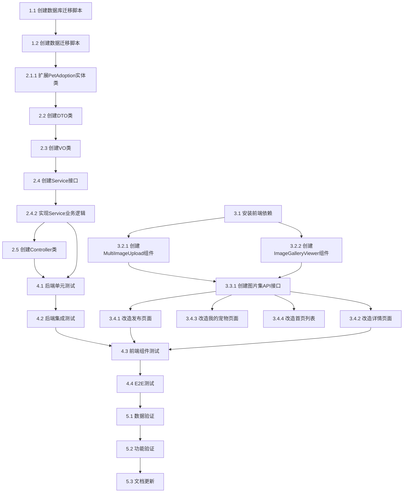

# 宠物图片集功能编码任务列表

## 任务概览
- **总任务数**: 32个主任务
- **预估总工时**: 42小时
- **任务分类**: 数据库迁移(2) + 后端开发(11) + 前端开发(12) + 测试任务(7)
- **优先级分布**: P0(18个) + P1(10个) + P2(4个)

---

## 1. 数据库迁移任务 (P0)

### 1.1 创建数据库表结构迁移脚本
- [ ] **创建数据库字段扩展SQL脚本**
  - **涉及文件**: `src/main/resources/db/migration/V1.0.6__add_gallery_fields.sql`
  - **任务描述**:
    - 添加 cover_photo_url 字段到 pet_adoption 表
    - 修改 photo_urls 字段为 TEXT 类型并更新注释
    - 创建索引优化查询性能
  - **验收标准**:
    - SQL脚本语法正确
    - 包含字段说明注释
    - 索引创建语句正确
  - **预估工时**: 0.5小时
  - **优先级**: P0

### 1.2 创建数据迁移脚本
- [ ] **创建存量数据迁移SQL脚本**
  - **涉及文件**: `src/main/resources/db/migration/V1.0.7__migrate_photo_data.sql`
  - **任务描述**:
    - 将存量 photo_urls 数据迁移到 cover_photo_url 字段
    - 将剩余图片URL转换为JSON数组格式
    - 处理空值和边界情况
  - **验收标准**:
    - 正确提取第一张图片作为封面
    - 剩余图片正确转为JSON数组
    - NULL值处理正确
  - **预估工时**: 1小时
  - **优先级**: P0

---

## 2. 后端开发任务

### 2.1 实体类扩展 (P0)

#### 2.1.1 扩展PetAdoption实体类
- [ ] **在PetAdoption实体类中添加图片集相关字段**
  - **涉及文件**: `src/main/java/com/pet/adoption/entity/PetAdoption.java`
  - **任务描述**:
    - 添加 coverPhotoUrl 字段(封面照片URL)
    - 添加 photoUrls 字段(图片集URL列表)
    - 添加 @TableField 注解映射数据库字段
    - 添加字段注释说明
  - **验收标准**:
    - 字段命名符合驼峰规范
    - 注解配置正确
    - 字段注释清晰
  - **预估工时**: 0.5小时
  - **优先级**: P0

### 2.2 DTO类创建 (P0)

#### 2.2.1 创建封面照片上传DTO
- [ ] **创建CoverPhotoUploadDTO类**
  - **涉及文件**: `src/main/java/com/pet/adoption/dto/CoverPhotoUploadDTO.java`
  - **任务描述**:
    - 定义 petId 字段(领养信息ID)
    - 定义 file 字段(MultipartFile)
    - 添加参数校验注解(@NotBlank, @NotNull)
  - **验收标准**:
    - 字段校验注解正确
    - 符合项目DTO规范
  - **预估工时**: 0.5小时
  - **优先级**: P0

#### 2.2.2 创建图片集上传DTO
- [ ] **创建GalleryUploadDTO类**
  - **涉及文件**: `src/main/java/com/pet/adoption/dto/GalleryUploadDTO.java`
  - **任务描述**:
    - 定义 petId 字段
    - 定义 files 字段(MultipartFile数组)
    - 添加参数校验注解
  - **验收标准**:
    - 支持批量文件上传
    - 校验注解配置正确
  - **预估工时**: 0.5小时
  - **优先级**: P0

#### 2.2.3 创建图片顺序更新DTO
- [ ] **创建GalleryOrderDTO类**
  - **涉及文件**: `src/main/java/com/pet/adoption/dto/GalleryOrderDTO.java`
  - **任务描述**:
    - 定义 imageUrls 字段(List<String>)
    - 添加 @NotEmpty 和 @Size(max=9) 校验
  - **验收标准**:
    - 限制最多9张图片
    - 校验注解配置正确
  - **预估工时**: 0.5小时
  - **优先级**: P0

### 2.3 VO类创建 (P0)

#### 2.3.1 创建上传结果VO
- [ ] **创建UploadVO和GalleryUploadVO类**
  - **涉及文件**: 
    - `src/main/java/com/pet/adoption/vo/UploadVO.java`
    - `src/main/java/com/pet/adoption/vo/GalleryUploadVO.java`
  - **任务描述**:
    - UploadVO包含 url 字段
    - GalleryUploadVO包含 urls 字段(List<String>)
  - **验收标准**:
    - 字段命名清晰
    - 符合项目VO规范
  - **预估工时**: 0.5小时
  - **优先级**: P0

#### 2.3.2 创建图片集查询VO
- [ ] **创建GalleryVO类**
  - **涉及文件**: `src/main/java/com/pet/adoption/vo/GalleryVO.java`
  - **任务描述**:
    - 定义 coverPhotoUrl 字段
    - 定义 galleryUrls 字段(List<String>)
  - **验收标准**:
    - 包含封面照片和图片集信息
    - 字段命名规范
  - **预估工时**: 0.5小时
  - **优先级**: P0

### 2.4 Service层开发 (P0)

#### 2.4.1 创建Service接口
- [ ] **创建PetGalleryService接口**
  - **涉及文件**: `src/main/java/com/pet/adoption/service/PetGalleryService.java`
  - **任务描述**:
    - 定义 uploadCoverPhoto 方法
    - 定义 uploadGallery 方法
    - 定义 deleteGalleryImage 方法
    - 定义 updateGalleryOrder 方法
    - 定义 getGallery 方法
  - **验收标准**:
    - 接口方法定义完整
    - 参数和返回值类型明确
  - **预估工时**: 0.5小时
  - **优先级**: P0

#### 2.4.2 实现Service业务逻辑
- [ ] **创建PetGalleryServiceImpl实现类**
  - **涉及文件**: `src/main/java/com/pet/adoption/service/impl/PetGalleryServiceImpl.java`
  - **任务描述**:
    - 实现封面照片上传逻辑(校验、删除旧文件、上传新文件、更新数据库)
    - 实现图片集上传逻辑(校验数量、批量上传、合并URL、更新数据库)
    - 实现图片删除逻辑(校验索引、删除文件、更新数据库)
    - 实现图片顺序更新逻辑
    - 实现图片集查询逻辑
    - 实现辅助方法(validateImageFile, parsePhotoUrls, toJsonArray)
  - **验收标准**:
    - 所有业务逻辑正确实现
    - 事务注解配置正确
    - 异常处理完善
    - 支持JSON数组和逗号分隔字符串两种格式(向后兼容)
  - **预估工时**: 3小时
  - **优先级**: P0

### 2.5 Controller层开发 (P0)

#### 2.5.1 创建Controller类
- [ ] **创建PetGalleryController控制器**
  - **涉及文件**: `src/main/java/com/pet/adoption/controller/PetGalleryController.java`
  - **任务描述**:
    - 实现 POST /api/pet-adoption/{id}/cover-photo 接口(上传封面照片)
    - 实现 POST /api/pet-adoption/{id}/gallery 接口(上传图片集)
    - 实现 DELETE /api/pet-adoption/{id}/gallery/{imageIndex} 接口(删除图片)
    - 实现 PUT /api/pet-adoption/{id}/gallery/order 接口(更新图片顺序)
    - 实现 GET /api/pet-adoption/{id}/gallery 接口(查询图片集)
    - 添加Swagger注解(@Api, @ApiOperation)
    - 添加参数校验(@Validated)
  - **验收标准**:
    - RESTful API设计规范
    - 所有接口功能正确
    - Swagger文档完整
    - 统一响应格式
  - **预估工时**: 2小时
  - **优先级**: P0

---

## 3. 前端开发任务

### 3.1 依赖安装 (P0)

#### 3.1.1 安装前端依赖包
- [ ] **安装图片集功能所需的前端依赖**
  - **涉及文件**: `frontend/package.json`
  - **任务描述**:
    - 安装 vuedraggable@2.24 (拖拽排序)
    - 安装 vue-lazyload@1.3 (图片懒加载)
  - **验收标准**:
    - 依赖版本正确
    - 安装成功无报错
  - **预估工时**: 0.5小时
  - **优先级**: P0

### 3.2 组件开发 (P0)

#### 3.2.1 创建多图上传组件
- [ ] **创建MultiImageUpload.vue组件**
  - **涉及文件**: `frontend/src/components/MultiImageUpload.vue`
  - **任务描述**:
    - 实现图片选择和预览功能(基于el-upload)
    - 实现文件格式和大小校验(jpg/png/jpeg, ≤5MB)
    - 实现拖拽排序功能(基于vuedraggable)
    - 实现图片删除功能
    - 实现上传数量限制(最多9张)
    - 支持v-model双向绑定
    - 触发sort-change事件
  - **验收标准**:
    - 上传功能正常
    - 拖拽排序流畅
    - 校验逻辑正确
    - 组件可复用
  - **预估工时**: 3小时
  - **优先级**: P0

#### 3.2.2 创建图片浏览组件
- [ ] **创建ImageGalleryViewer.vue组件**
  - **涉及文件**: `frontend/src/components/ImageGalleryViewer.vue`
  - **任务描述**:
    - 实现大图预览功能
    - 实现左右切换按钮
    - 实现缩略图导航
    - 实现键盘快捷键支持(← →切换, ESC关闭)
    - 实现图片懒加载
    - 实现对话框样式优化
  - **验收标准**:
    - 图片切换流畅
    - 缩略图导航准确
    - 键盘事件响应正确
    - 样式美观大方
  - **预估工时**: 2小时
  - **优先级**: P0

### 3.3 API接口封装 (P0)

#### 3.3.1 创建图片集API接口
- [ ] **创建petGallery.js API文件**
  - **涉及文件**: `frontend/src/api/petGallery.js`
  - **任务描述**:
    - 封装上传封面照片接口
    - 封装上传图片集接口
    - 封装删除图片接口
    - 封装更新图片顺序接口
    - 封装查询图片集接口
  - **验收标准**:
    - 所有接口封装完整
    - 请求和响应处理正确
    - 错误处理完善
  - **预估工时**: 1小时
  - **优先级**: P0

### 3.4 页面改造 (P0/P1)

#### 3.4.1 改造发布页面
- [ ] **改造Publish.vue发布页面**
  - **涉及文件**: `frontend/src/views/pet/Publish.vue`
  - **任务描述**:
    - 添加封面照片上传区域(使用el-upload)
    - 添加图片集上传区域(使用MultiImageUpload组件)
    - 添加表单校验规则(封面照片必填)
    - 修改提交逻辑(将galleryUrls转为JSON字符串)
    - 优化上传提示文案
  - **验收标准**:
    - 封面照片上传正常
    - 图片集上传正常
    - 表单校验正确
    - 提交数据格式正确
  - **预估工时**: 2小时
  - **优先级**: P0

#### 3.4.2 改造宠物详情页
- [ ] **改造PetDetail.vue详情页面**
  - **涉及文件**: `frontend/src/views/pet/PetDetail.vue`
  - **任务描述**:
    - 添加封面照片展示区域(可点击打开浏览组件)
    - 添加图片集缩略图展示区域
    - 集成ImageGalleryViewer组件
    - 实现图片集数据解析(支持JSON数组和逗号分隔字符串)
    - 实现点击缩略图打开浏览组件
    - 优化图片加载性能(懒加载)
  - **验收标准**:
    - 封面照片和图片集正确展示
    - 图片浏览组件功能正常
    - 数据解析兼容旧格式
    - 页面性能良好
  - **预估工时**: 2小时
  - **优先级**: P0

#### 3.4.3 改造我的宠物页面
- [ ] **改造MyPets.vue我的宠物页面**
  - **涉及文件**: `frontend/src/views/pet/MyPets.vue`
  - **任务描述**:
    - 修改宠物列表卡片展示逻辑(使用coverPhotoUrl作为封面)
    - 优化图片加载性能
    - 修改编辑功能(跳转到发布页面并预填充图片数据)
  - **验收标准**:
    - 列表展示正确
    - 编辑功能正常
    - 性能优化有效
  - **预估工时**: 1.5小时
  - **优先级**: P1

#### 3.4.4 改造首页列表
- [ ] **改造Home.vue首页宠物列表**
  - **涉及文件**: `frontend/src/views/Home.vue`
  - **任务描述**:
    - 修改宠物卡片封面展示逻辑(使用coverPhotoUrl)
    - 优化图片懒加载
    - 保持向后兼容(无封面时使用第一张图片)
  - **验收标准**:
    - 列表展示正确
    - 向后兼容性好
    - 性能优化有效
  - **预估工时**: 1小时
  - **优先级**: P1

### 3.5 全局配置 (P1)

#### 3.5.1 配置vue-lazyload插件
- [ ] **在main.js中配置vue-lazyload插件**
  - **涉及文件**: `frontend/src/main.js`
  - **任务描述**:
    - 引入vue-lazyload插件
    - 配置懒加载参数(loading图片, error图片)
    - 注册插件到Vue实例
  - **验收标准**:
    - 插件配置正确
    - 懒加载功能生效
  - **预估工时**: 0.5小时
  - **优先级**: P1

---

## 4. 测试任务

### 4.1 后端单元测试 (P1)

#### 4.1.1 编写Service层单元测试
- [ ] **创建PetGalleryServiceImplTest测试类**
  - **涉及文件**: `src/test/java/com/pet/adoption/service/impl/PetGalleryServiceImplTest.java`
  - **任务描述**:
    - 测试封面照片上传功能
    - 测试图片集上传功能(正常、超限场景)
    - 测试图片删除功能(正常、索引无效场景)
    - 测试图片顺序更新功能
    - 测试图片集查询功能
    - 测试向后兼容逻辑(JSON数组和逗号分隔字符串)
  - **验收标准**:
    - 测试覆盖率≥80%
    - 所有关键场景覆盖
    - 边界情况测试完整
  - **预估工时**: 3小时
  - **优先级**: P1

#### 4.1.2 编写Controller层单元测试
- [ ] **创建PetGalleryControllerTest测试类**
  - **涉及文件**: `src/test/java/com/pet/adoption/controller/PetGalleryControllerTest.java`
  - **任务描述**:
    - 测试所有REST接口
    - 测试参数校验逻辑
    - 测试异常处理
    - 测试权限校验
  - **验收标准**:
    - 所有接口测试覆盖
    - 异常场景测试完整
  - **预估工时**: 2小时
  - **优先级**: P1

### 4.2 后端集成测试 (P1)

#### 4.2.1 编写集成测试
- [ ] **创建PetGalleryIntegrationTest测试类**
  - **涉及文件**: `src/test/java/com/pet/adoption/integration/PetGalleryIntegrationTest.java`
  - **任务描述**:
    - 测试完整的图片上传流程
    - 测试图片删除流程
    - 测试数据库数据一致性
    - 测试文件存储服务集成
  - **验收标准**:
    - 集成测试通过
    - 数据一致性验证正确
  - **预估工时**: 2小时
  - **优先级**: P1

### 4.3 前端组件测试 (P2)

#### 4.3.1 编写MultiImageUpload组件测试
- [ ] **创建MultiImageUpload组件测试文件**
  - **涉及文件**: `frontend/tests/unit/components/MultiImageUpload.spec.js`
  - **任务描述**:
    - 测试图片上传功能
    - 测试文件校验逻辑
    - 测试拖拽排序功能
    - 测试数量限制逻辑
  - **验收标准**:
    - 关键功能测试覆盖
    - 组件交互测试正确
  - **预估工时**: 1.5小时
  - **优先级**: P2

#### 4.3.2 编写ImageGalleryViewer组件测试
- [ ] **创建ImageGalleryViewer组件测试文件**
  - **涉及文件**: `frontend/tests/unit/components/ImageGalleryViewer.spec.js`
  - **任务描述**:
    - 测试图片切换功能
    - 测试缩略图导航
    - 测试键盘事件响应
  - **验收标准**:
    - 交互功能测试完整
  - **预估工时**: 1小时
  - **优先级**: P2

### 4.4 E2E测试 (P2)

#### 4.4.1 编写端到端测试
- [ ] **创建图片集功能E2E测试**
  - **涉及文件**: `frontend/tests/e2e/specs/pet-gallery.spec.js`
  - **任务描述**:
    - 测试发布页面图片上传流程
    - 测试详情页图片浏览流程
    - 测试我的宠物页面编辑流程
  - **验收标准**:
    - 核心业务流程测试覆盖
    - 用户交互场景完整
  - **预估工时**: 2小时
  - **优先级**: P2

---

## 5. 验证与优化任务

### 5.1 数据验证 (P1)

#### 5.1.1 执行数据库迁移验证
- [ ] **验证数据库迁移脚本执行结果**
  - **涉及文件**: 数据库迁移脚本
  - **任务描述**:
    - 在测试环境执行迁移脚本
    - 验证字段添加正确
    - 验证数据迁移正确
    - 验证索引创建成功
  - **验收标准**:
    - 迁移脚本执行无报错
    - 数据完整性验证通过
  - **预估工时**: 1小时
  - **优先级**: P1

### 5.2 功能验证 (P1)

#### 5.2.1 执行功能验证测试
- [ ] **执行完整功能验证**
  - **涉及文件**: 所有功能模块
  - **任务描述**:
    - 验证发布流程(封面照片+图片集上传)
    - 验证浏览流程(详情页+图片浏览组件)
    - 验证编辑流程(我的宠物页面)
    - 验证向后兼容性(旧数据正常展示)
    - 验证性能优化效果(懒加载、拖拽排序)
  - **验收标准**:
    - 所有功能正常运行
    - 向后兼容性验证通过
    - 性能指标达标
  - **预估工时**: 2小时
  - **优先级**: P1

### 5.3 文档更新 (P2)

#### 5.3.1 更新接口文档
- [ ] **更新Swagger接口文档**
  - **涉及文件**: Controller类
  - **任务描述**:
    - 验证Swagger注解完整
    - 确认接口文档可访问
    - 验证接口示例正确
  - **验收标准**:
    - Swagger文档完整准确
    - 接口示例可执行
  - **预估工时**: 0.5小时
  - **优先级**: P2

---

## 任务依赖关系

---

## 执行建议

### 开发顺序
1. **第一阶段(数据库层)**: 执行所有数据库迁移任务(1.1-1.2)
2. **第二阶段(后端层)**: 按照实体→DTO→VO→Service→Controller顺序开发(2.1-2.5)
3. **第三阶段(前端层)**: 先安装依赖,再开发组件,最后改造页面(3.1-3.5)
4. **第四阶段(测试层)**: 按照单元测试→集成测试→组件测试→E2E测试顺序(4.1-4.4)
5. **第五阶段(验证优化)**: 执行验证和文档更新任务(5.1-5.3)

### 风险提示
- **数据迁移风险**: 执行迁移脚本前务必备份数据库
- **向后兼容性**: 确保旧数据在 photo_urls 字段为逗号分隔格式时仍能正常展示
- **文件存储空间**: 注意监控文件存储空间使用情况
- **性能优化**: 图片懒加载和拖拽排序功能需充分测试性能

### 注意事项
- 所有P0优先级任务必须完成才能进入下一阶段
- 测试覆盖率需达到90%以上才能打包
- 每个任务完成后需及时更新任务状态
- 遇到阻塞问题及时反馈并调整计划

---

## 任务执行进度

**当前进度**: 待开始 (0/32)

| 任务分类 | 总数 | 已完成 | 进度 |
|---------|------|--------|------|
| 数据库迁移 | 2 | 0 | 0% |
| 后端开发 | 11 | 0 | 0% |
| 前端开发 | 12 | 0 | 0% |
| 测试任务 | 7 | 0 | 0% |
| **总计** | **32** | **0** | **0%** |
